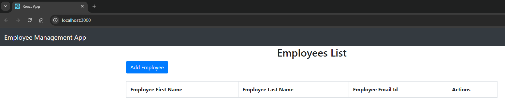
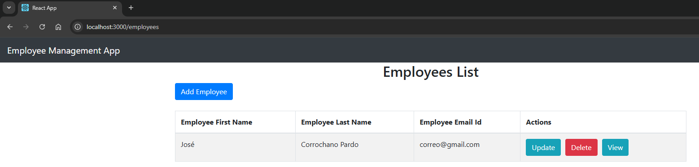

# 🖥️ Paso 0 - Prueba Local

Antes de considerar cualquier tipo de contenedorización o despliegue, el Paso 0 ha sido crucial para la validación del proyecto en mi entorno local. Este documento se enfoca en describir el proceso que seguí para instalar todas las dependencias y ejecutar la aplicación en mi máquina, asegurando su correcto funcionamiento antes de proceder con pasos más avanzados. Mi objetivo principal fue verificar que todo operaba según lo esperado sin la complejidad adicional de herramientas como Docker.

---

## 📋 Tabla de contenidos 

- [🖥️ Paso 0 - Prueba Local](#️-paso-0---prueba-local)
  - [📋 Tabla de contenidos](#-tabla-de-contenidos)
  - [1️⃣ Instalar Node.js y npm (para el frontend)](#1️⃣-instalar-nodejs-y-npm-para-el-frontend)
  - [2️⃣ Instalar Java 17 (para el backend)](#2️⃣-instalar-java-17-para-el-backend)
  - [3️⃣ Instalar MySQL (base de datos)](#3️⃣-instalar-mysql-base-de-datos)
  - [4️⃣ Crear la base de datos](#4️⃣-crear-la-base-de-datos)
  - [5️⃣ Navegar al directorio del backend](#5️⃣-navegar-al-directorio-del-backend)
  - [6️⃣ Ejecutar el backend con Maven](#6️⃣-ejecutar-el-backend-con-maven)
  - [7️⃣ Abrir una nueva terminal y navegar al frontend](#7️⃣-abrir-una-nueva-terminal-y-navegar-al-frontend)
  - [8️⃣ Instalar dependencias de Node.js](#8️⃣-instalar-dependencias-de-nodejs)
  - [9️⃣ Ejecutar el frontend](#9️⃣-ejecutar-el-frontend)
  - [🔟 Verificar funcionamiento](#-verificar-funcionamiento)
    
---

## 1️⃣ Instalar Node.js y npm (para el frontend)

```bash
curl -fsSL https://deb.nodesource.com/setup_18.x | sudo -E bash -
sudo apt-get install -y nodejs

node --version
npm --version
```

Y verificar la instalación:

```bash
node --version
npm --version
```

---

## 2️⃣ Instalar Java 17 (para el backend)

```bash
sudo apt update
sudo apt install openjdk-17-jdk
```

Verificar la instalación:

```bash
java --version
javac --version
```

Configurar JAVA_HOME:

```bash
echo 'export JAVA_HOME=/usr/lib/jvm/java-17-openjdk-amd64' >> ~/.bashrc
source ~/.bashrc
```

> JAVA_HOME es una variable de entorno que apunta al JDK. Se configura al inicio para que herramientas como Maven encuentren la versión correcta de Java.

---

## 3️⃣ Instalar MySQL (base de datos)

```bash
sudo apt update
sudo apt install mysql-server
```

Iniciar MySQL:

```bash
sudo systemctl start mysql
sudo systemctl enable mysql
```

Configurar MySQL (establecer contraseña root):

```bash
sudo mysql_secure_installation
```

---

## 4️⃣ Crear la base de datos

Acceder a MySQL como root:

```bash
sudo mysql -u root -p
```

Crear la base de datos:

```bash
CREATE DATABASE employee_management_system;
```

Modificar el usuario para una mayor seguridad:

```bash
ALTER USER 'root'@'localhost' IDENTIFIED WITH mysql_native_password BY 'TuContrasenaMasSeguraAqui!';
FLUSH PRIVILEGES;
```

Cambiar en el archivo `src/main/resources/application.properties` la nueva contraseña en la siguiente línea:

```bash
spring.datasource.password=TuContrasenaMasSeguraAqui!
```

Y Salir:

```bash
EXIT;
```

[🔝 Volver a la tabla de contenidos 🔝](#-tabla-de-contenidos) 

---

## 5️⃣ Navegar al directorio del backend

```bash
cd BackEnd-DevOps-App
```

---

## 6️⃣ Ejecutar el backend con Maven

Primero hay que dar permisos de ejecución al wrapper de Maven:

```bash
chmod +x mvnw
```

Instalamos maven:

```bash
sudo apt update && sudo apt install maven -y
```

Descargamos el maven wrapper para el proyecto:


```bash
mvn wrapper:wrapper
```

Y después ejecutar la aplicación:

```bash
./mvnw spring-boot:run
```

[🔝 Volver a la tabla de contenidos 🔝](#-tabla-de-contenidos) 

---

## 7️⃣ Abrir una nueva terminal y navegar al frontend

```bash
cd FrontEnd-DevOps-App
```

---

## 8️⃣ Instalar dependencias de Node.js

```bash
npm install
```

---

## 9️⃣ Ejecutar el frontend

```shellscript
export NODE_OPTIONS=--openssl-legacy-provider && npm start
```

**El frontend estará corriendo en:** `http://localhost:3000`

> El comando `export NODE_OPTIONS=--openssl-legacy-provider` es una solución rápida para que el proyecto frontend, si es un poco antiguo, funcione con versiones nuevas de Node.js (17+). Básicamente, le dice a Node.js que sea más permisivo con ciertas partes de código, evitando errores.

---

## 🔟 Verificar funcionamiento

Para comprobar que todo funciona correctamente tenemos que verificar que funcione tanto el backend como el frontend. Para probar el frontend accedemos a `http://localhost:3000`:



Y si probamos a añadir un empleado rellenando los datos correspondientes, al guardarlo nos debería aparecer en la pantalla principal:



[🔝 Volver a la tabla de contenidos 🔝](#-tabla-de-contenidos) 


