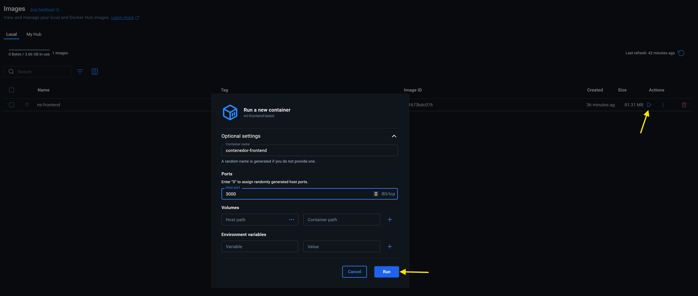
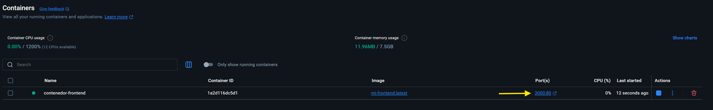
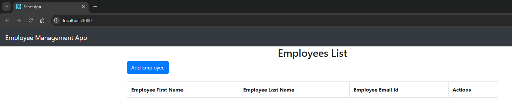
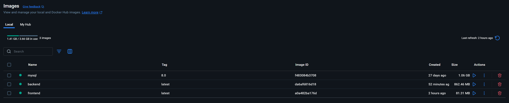
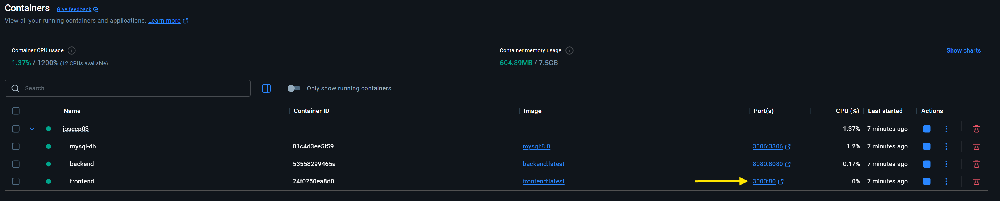
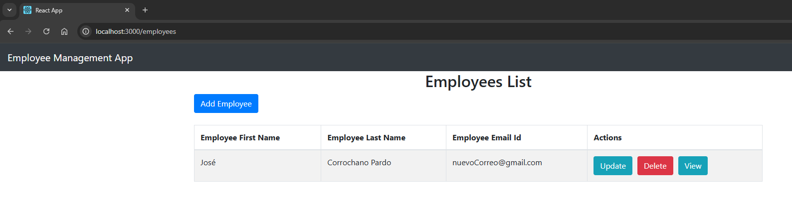

# 🐳 Paso 1 - Dockerización

La dockerización consiste en encapsular una aplicación y todas sus dependencias dentro de contenedores ligeros e independientes. Esto permite que la aplicación se ejecute de manera consistente en cualquier entorno, desde un ordenador local hasta servidores de producción, sin preocuparse por diferencias de sistema operativo, librerías o configuraciones. Además, facilita la gestión de múltiples servicios relacionados, la escalabilidad y el aislamiento de entornos.

Conseguimos encapuslar dicha aplicaicón con un archivo llamado `Dockerfile`. Un Dockerfile es un archivo de texto que contiene las instrucciones necesarias para construir una imagen de Docker. Define desde qué imagen base partir, qué dependencias instalar, cómo copiar el código de la aplicación, qué variables de entorno configurar y qué comando ejecutar cuando se inicie el contenedor. En resumen, un Dockerfile describe paso a paso cómo “empaquetar” una aplicación dentro de un contenedor.

---

## 📋 Tabla de contenidos

- [🐳 Paso 1 - Dockerización](#-paso-1---dockerización)
  - [📋 Tabla de contenidos](#-tabla-de-contenidos)
  - [🖼️ 1.1 Frontend](#️-11-frontend)
  - [⚙️ 1.2 Backend (docker-compose)](#️-12-backend-docker-compose)

---

## 🖼️ 1.1 Frontend

El Dockerfile del frontend se divide en dos etapas: primero, la **build del frontend**, donde se utiliza una imagen ligera de Node.js (node:18-alpine) para instalar las dependencias del proyecto y generar los archivos estáticos de producción (npm run build), asegurando una construcción rápida y reproducible; y segundo, el **servidor Nginx**, que sirve los archivos estáticos generados en la primera etapa, copiándolos al directorio público de Nginx y reemplazando la configuración por defecto para permitir el uso de React Router, exponiendo finalmente el puerto 80 e iniciando Nginx en primer plano para mantener el contenedor activo.

```Dockerfile
# Etapa 1: build del frontend con Node.js 18 en Alpine Linux para mantener la imagen ligera
FROM node:18-alpine AS build

# Establece el directorio de trabajo dentro del contenedor
WORKDIR /app

# Copia package.json y package-lock.json primero para aprovechar la caché de Docker
COPY package*.json ./

# Instala las dependencias del proyecto. 'npm ci' asegura compilaciones reproducibles
RUN npm ci

# Copia el resto del código de la aplicación
COPY . .

# La variable NODE_OPTIONS se incluye para compatibilidad con Node.js 17+
ENV NODE_OPTIONS=--openssl-legacy-provider

# Genera los archivos estáticos de producción en el directorio /build
RUN npm run build

# Etapa 2: Servidor Nginx para servir los archivos estáticos generados por React
FROM nginx:alpine

# Copiar archivos generados en /build al root público de Nginx
COPY --from=build /app/build /usr/share/nginx/html

# Reemplazar la configuración de Nginx para que funcione con React Router
COPY nginx.conf /etc/nginx/conf.d/default.conf

# Establece el directorio de trabajo dentro del contenedor
EXPOSE 80

# Comando para iniciar Nginx en primer plano, lo que es necesario para que el contenedor se mantenga activo
CMD ["nginx", "-g", "daemon off;"]
```

Una vez creado el archivo en la carpeta raíz del proyecto frontend, se crea la imagen con el siguiente comando:

```bash
docker build -t mi-frontend .
```
> -t mi-frontend es para indicar el nombre de la imagen

* Cuando ya tenemos la imagen, se crea e inicia el contenedor desde la interfaz de `Docker Desktop` eligiendo el nombre del contenedor y el puerto, siendo 3000 el típico de React

  

* Después se accede a la url local `http://localhost:3000/` (Se puede desde la interfaz de Docker Desktop como se muestra en la imagen)

  

* Y se ve como se muestra nuestro frontend correctamente:

  

[🔝 Volver a la tabla de contenidos 🔝](#-tabla-de-contenidos) 

---

## ⚙️ 1.2 Backend (docker-compose)

El Dockerfile del backend sigue varios pasos: primero, se utiliza como imagen base OpenJDK 17 (eclipse-temurin:17-jdk-alpine) para ejecutar aplicaciones Java; luego, se copian los archivos de Maven (pom.xml, .mvn, mvnw) y se descargan todas las dependencias de forma offline para acelerar la construcción; a continuación, se copia el código fuente y se compila la aplicación Spring Boot en un archivo JAR ejecutable; finalmente, se expone el puerto 8080 y se define el comando para ejecutar el JAR, dejando el backend listo para comunicarse con la base de datos.

```Dockerfile
# Usa una imagen base de OpenJDK 17.
FROM eclipse-temurin:17-jdk-alpine

# Establece el directorio de trabajo dentro del contenedor.
WORKDIR /app

# Copia los archivos del Maven Wrapper y el pom.xml.
COPY mvnw .
COPY .mvn .mvn
COPY pom.xml .

# Descarga las dependencias de Maven.
RUN ./mvnw dependency:go-offline -B

# Copia el resto del código fuente de la aplicación.
COPY src src

# Construye la aplicación Spring Boot en un JAR ejecutable.
RUN ./mvnw package -DskipTests

# Expone el puerto en el que la aplicación Spring Boot escuchará (8080 por defecto).
EXPOSE 8080

# Define el comando para ejecutar la aplicación JAR.
CMD sh -c 'java -jar target/*.jar'
```
> Este Dockerfile se necesita para crear la imagen de nuestro backend, que más tarde usará el docker-compose para crear el contenedor correspondiente

Para probar localmente la conexión entre backend y base de datos, usar Docker Compose es más eficiente que crear un Dockerfile aparte para la base de datos. Compose permite levantar ambos servicios juntos con un solo comando, gestionar variables de entorno, redes internas y volúmenes de forma automática, y asegurar que el backend se conecte correctamente a la base de datos.

A diferencia del frontend, que se puede probar con un contenedor individual porque solo sirve archivos estáticos, el backend depende de la base de datos para funcionar. Por eso es más práctico usar Docker Compose para estos servicios y no levantar cada contenedor por separado.

```yaml
version: "3.9"

services:
  mysql-db:
    image: mysql:8.0
    container_name: mysql-db
    restart: always
    environment:
      MYSQL_ROOT_PASSWORD: MyS3cur3P@ssw0rd!
      MYSQL_DATABASE: employee_management_system
      MYSQL_USER: empleados
      MYSQL_PASSWORD: miPass2025
    ports:
      - "3306:3306"

  backend:
    build:
      context: ./BackEnd-DevOps-App
      dockerfile: Dockerfile
    image: backend:latest
    container_name: backend
    restart: always
    ports:
      - "8080:8080"
    environment:
      SPRING_DATASOURCE_URL: jdbc:mysql://mysql-db:3306/employee_management_system
      SPRING_DATASOURCE_USERNAME: empleados
      SPRING_DATASOURCE_PASSWORD: miPass2025
    depends_on:
      - mysql-db

  frontend:
    build:
      context: ./FrontEnd-DevOps-App
      dockerfile: Dockerfile
    image: frontend:latest
    container_name: frontend
    restart: always
    ports:
      - "3000:80"
    depends_on:
      - backend
```

* Una vez tenemos creado el `docker-compose.yml` en la carpeta donde se encuentra por un lado la carpeta del backend, y por otro la caropeta del frontend, ejecutamos el docker-compose con el siguinete comando:

  ```bash
  docker-compose up --build
  ```

* Se crean las imágenes correspondientes:

  

* Se crean los contenedores:

  

* Y podemos usar la aplicación sin problema en `http://localhost:3000`:

  

[🔝 Volver a la tabla de contenidos 🔝](#-tabla-de-contenidos) 