# 🟦☁️ Paso 2 - Preparación del entorno Azure

Después de dockerizar la aplicación, es necesario preparar primero el entorno en **Azure**, creando los recursos básicos y configurando un **Service Principal** con sus variables de entorno. Este paso se hace antes de usar **Terraform** porque necesitamos que la infraestructura base y las credenciales estén listas para que Terraform pueda desplegar y gestionar los recursos de forma segura y automatizada. **Azure** es la nube de Microsoft que ofrece una amplia gama de servicios, como máquinas virtuales, bases de datos, redes, almacenamiento, contenedores y herramientas de automatización, lo que la convierte en una plataforma completa para desarrollar, desplegar y escalar aplicaciones en la nube.

Los pasos que vamos a seguir para preparar el entorno en Azure antes de usar Terraform son los siguientes:

1. Crear una cuenta gratuita de Azure e instalar Azure CLI en nuestra máquina local.

2. Configurar los recursos básicos necesarios: grupos de recursos, cuentas de almacenamiento, contenedores y Azure Container Registry (ACR).

3. Generar un Service Principal y obtener las credenciales necesarias (ARM_CLIENT_ID, ARM_CLIENT_SECRET, ARM_TENANT_ID y ARM_SUBSCRIPTION_ID).

4. Asignarle el rol Contributor al Service Principal para que tenga permisos adecuados.

5. Exportar estas credenciales como variables de entorno en la máquina, asegurando que Terraform pueda gestionar la infraestructura de manera segura y automatizada.

---

## 📋 Tabla de contenidos

- [🟦☁️ Paso 2 - Preparación del entorno Azure](#️-paso-2---preparación-del-entorno-azure)
  - [📋 Tabla de contenidos](#-tabla-de-contenidos)
  - [☁️ 2.1 Crear cuenta Azure e instalación Azure CLI](#️-21-crear-cuenta-azure-e-instalación-azure-cli)
  - [🏗️ 2.2 Configurar recursos básicos de Azure](#️-22-configurar-recursos-básicos-de-azure)
    - [📦 1. Grupo de recursos](#-1-grupo-de-recursos)
    - [🗄️ 2. Storage account](#️-2-storage-account)
    - [📂 3. Contenedor tfstate](#-3-contenedor-tfstate)
    - [📂 4. Contenedor backups](#-4-contenedor-backups)
    - [🏷️ 5. Azure Container Registry (ACR)](#️-5-azure-container-registry-acr)
  - [🔑 2.3 Generar Service Principal y obtener credenciales](#-23-generar-service-principal-y-obtener-credenciales)
    - [🆔 1. `ARM_SUBSCRIPTION_ID`](#-1-arm_subscription_id)
    - [🆔 2. `ARM_CLIENT_ID` \& `ARM_TENANT_ID`](#-2-arm_client_id--arm_tenant_id)
    - [🔐 3. `ARM_CLIENT_SECRET`](#-3-arm_client_secret)
  - [🛡️ 2.3 Asignar permisos al Servie Principal](#️-23-asignar-permisos-al-servie-principal)
  - [💻 2.4 Exportar credenciales como variables de entorno](#-24-exportar-credenciales-como-variables-de-entorno)
  - [📦 2.5 Publicación de imágenes Docker en ACR](#-25-publicación-de-imágenes-docker-en-acr)

---

## ☁️ 2.1 Crear cuenta Azure e instalación Azure CLI

Antes de poder desplegar nuestra infraestructura, necesitamos una cuenta en **Azure** para poder crear y gestionar los recursos. Para ello podemos registrarnos en la página de Azure
y seleccionar la opción de cuenta gratuita, que nos permite empezar **sin coste**. Con esta cuenta, obtenemos un **crédito inicial de unos 200 $ durante los primeros 30 días** y acceso a ciertos servicios gratuitos durante 12 meses, además de otros servicios siempre gratuitos con límites mensuales. Esto nos permite probar, desplegar y experimentar sin que se nos genere un coste mientras nos mantenemos dentro de los límites del plan gratuito.

Una vez creada la cuenta, el siguiente paso es instalar **Azure CLI** en nuestra máquina local. Esta herramienta nos permitirá interactuar con Azure desde la terminal, crear y gestionar recursos, y autenticar Terraform. 

* La instalación se realiza con el siguiente comando:

    ```bash
    curl -sL https://aka.ms/InstallAzureCLIDeb | sudo bash
    ```

* Para comprobar que se ha instalado correctamente, podemos ejecutar:

    ```bash
    az --version
    ```

Con esto, ya tendremos nuestra máquina lista para conectarse a Azure y empezar a crear los recursos necesarios para nuestro proyecto.

---

## 🏗️ 2.2 Configurar recursos básicos de Azure

Antes de poder desplegar nuestra infraestructura con Terraform, necesitamos configurar primero los recursos básicos en Azure que serán utilizados más adelante. Esto nos asegura que la infraestructura tenga un punto de partida estable y que Terraform pueda gestionar correctamente los recursos sin problemas de dependencias.

En esta fase vamos a crear los siguientes recursos principales:

1. **Grupo de recursos**

2. **Storage Account**

3. **Contenedor tfstate**

4. **Contenedor backups**

5. **Azure Container Registry (ACR)**

### 📦 1. Grupo de recursos

Un **grupo de recursos** en Azure es un contenedor que organiza todos los recursos relacionados de un proyecto. Nos permite gestionarlos de forma centralizada, aplicar permisos, supervisar costes y eliminarlos fácilmente, asegurando que la infraestructura esté ordenada y sea más fácil de mantener.

* Dicho esto, lo creamos como se indica en la siguinete captura:

    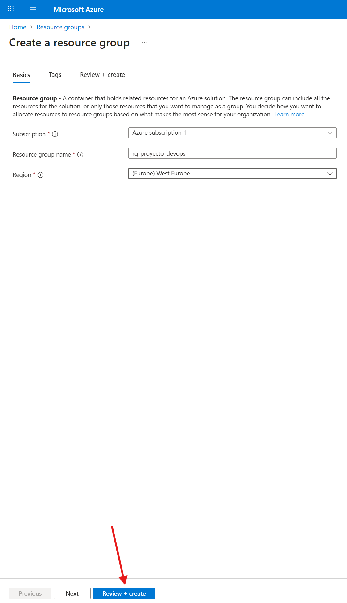

* Posteriormente, comprobamos que el grupo aparece en la lista de recursos, asegurándonos de que está disponible y listo para asociar los siguientes recursos que vamos a crear.

    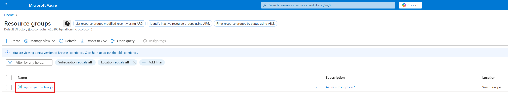

### 🗄️ 2. Storage account

Un **Storage Account** en Azure es una cuenta de almacenamiento donde podemos guardar datos, archivos y otros recursos que necesita nuestra infraestructura. Lo creamos porque es necesario para almacenar de forma segura y organizada información que usará nuestra aplicación y Terraform, como archivos de estado, contenedores y backups, asegurando que todo esté centralizado y accesible para los recursos que lo necesiten.

* Creamos el recurso como se indica en la siguiente captura de pantalla:

    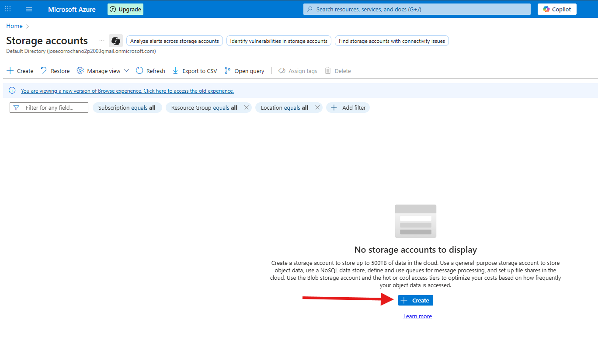

* Rellenamos los datos necesarios:

    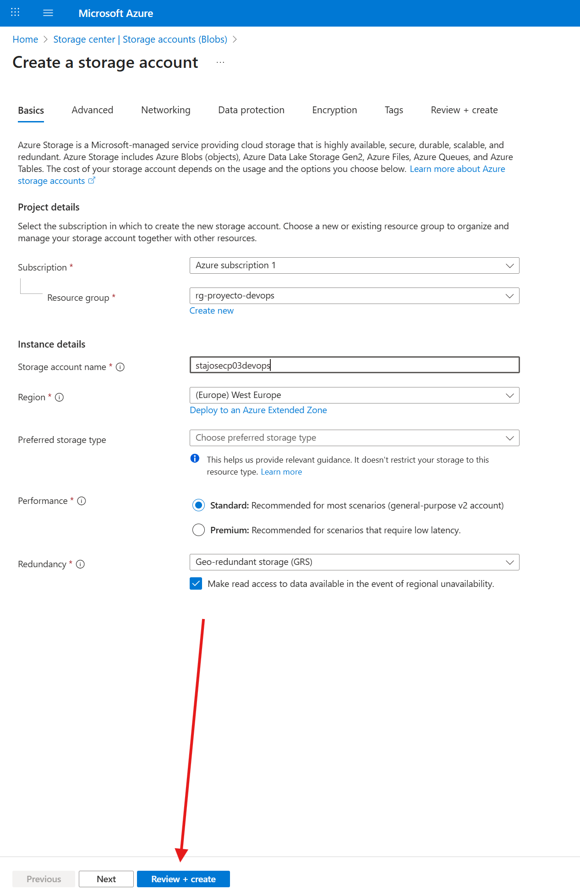

* Y comprobamos que se ha creado correctamente:

    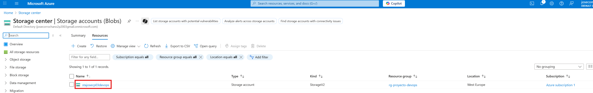

### 📂 3. Contenedor tfstate

Dentro del **Storage Account** necesitamos crear un **contenedor** porque es allí donde se almacenará el archivo `tfstate` de Terraform. Este archivo guarda el **estado de la infraestructura**, es decir, qué recursos se han creado, sus configuraciones y relaciones. Tenerlo en un contenedor nos permite mantener el estado centralizado, seguro y accesible para futuras actualizaciones o despliegues, evitando inconsistencias y asegurando que Terraform pueda gestionar correctamente todos los recursos.

* Creamos el contenedor como se indica en la captura:

    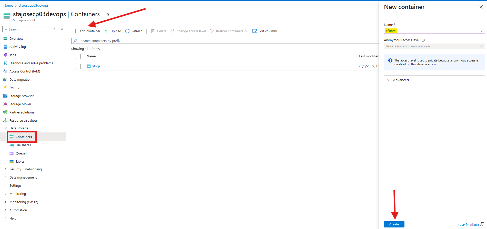

* Y vemos como se nos crea:

    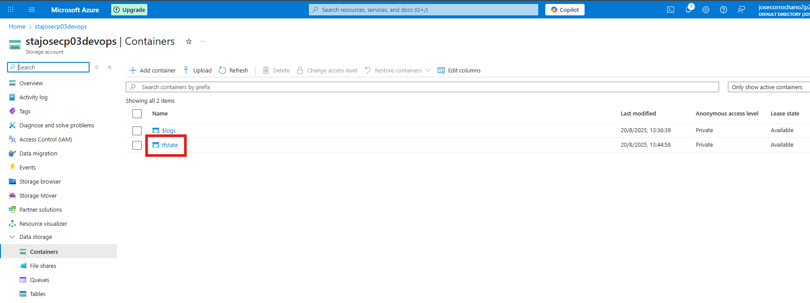

### 📂 4. Contenedor backups

Dentro del Storage Account necesitamos crear un contenedor para almacenar el archivo de backup de la base de datos, de manera que podamos recuperarla fácilmente en caso de fallos, pérdidas de información o incidencias, asegurando así la continuidad y disponibilidad de los datos.

* Creamos el contenedor como se indica en la captura:

    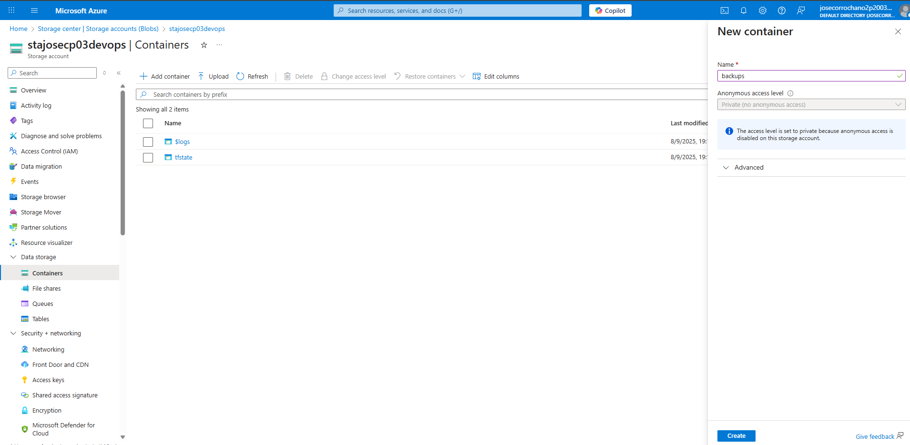

* Y vemos como se nos crea:

    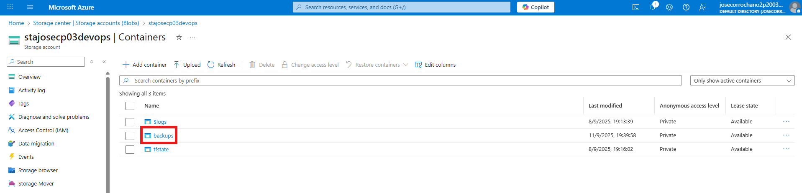

### 🏷️ 5. Azure Container Registry (ACR)

El **Azure Container Registry (ACR)** es un servicio donde almacenamos nuestras **imágenes Docker** antes de desplegarlas en Kubernetes. Lo creamos para **centralizar y gestionar las imágenes de manera segura**, facilitando su acceso desde los clústeres y automatizando despliegues. Así, todas las versiones de nuestras aplicaciones quedan organizadas y listas para ser usadas por Terraform, Helm o Kubernetes.

* Creamos este recurso en la siguiente sección:

    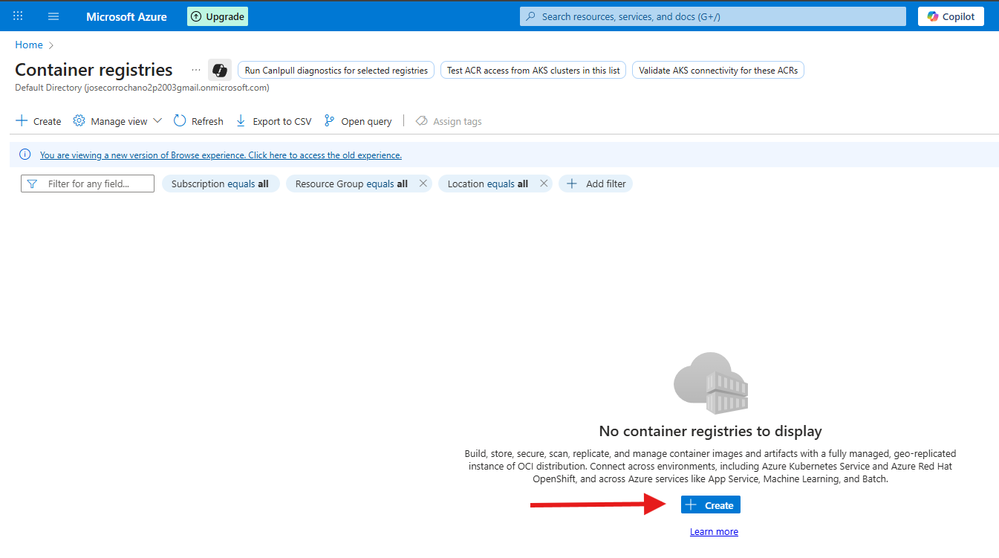

* Rellenamos los datos y creamos el contenedor:

    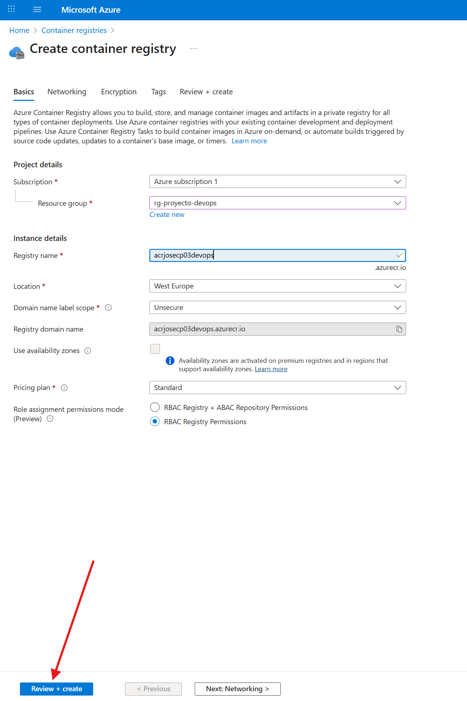

* Y comprobamos que se ha creado, teniendo así todo lo necesario:

    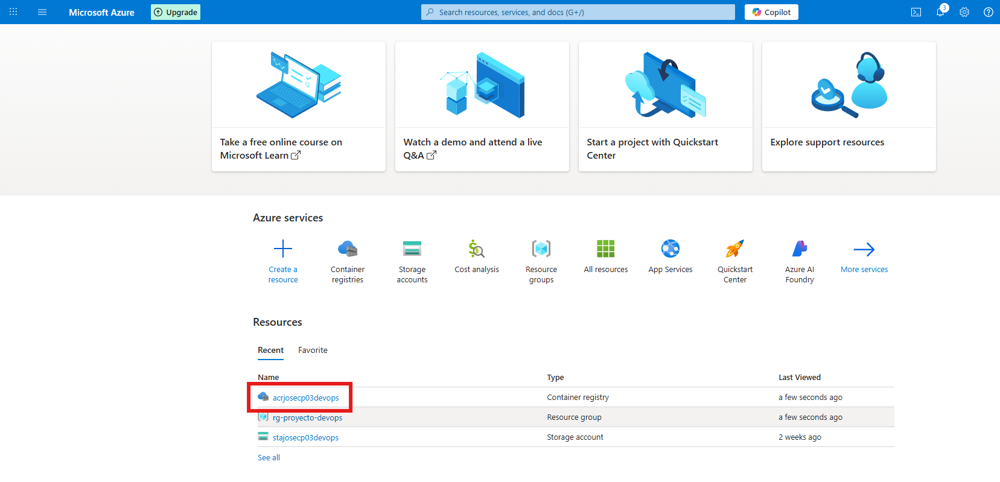

[🔝 Volver a la tabla de contenidos 🔝](#-tabla-de-contenidos) 

---

## 🔑 2.3 Generar Service Principal y obtener credenciales

En este punto necesitamos configurar las credenciales que Terraform usará para conectarse a Azure y poder desplegar la infraestructura. Para ello vamos a obtener 4 claves fundamentales:

1. `ARM_SUBSCRIPTION_ID`
2. `ARM_CLIENT_ID` & `ARM_TENANT_ID`
3. `ARM_CLIENT_SECRET`


### 🆔 1. `ARM_SUBSCRIPTION_ID`

La **Subscription ID** es un identificador único que representa tu suscripción en Azure, es decir, el “contrato” o plan bajo el que se crean y gestionan todos tus recursos. Es obligatoria porque le dice a Terraform en **qué suscripción** debe trabajar.

* La encontramos dentro de la suscripción como aparece en la siguiente captura:

    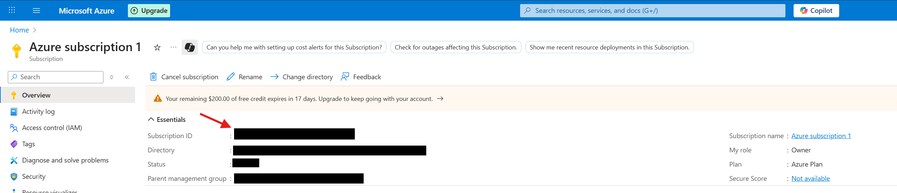

### 🆔 2. `ARM_CLIENT_ID` & `ARM_TENANT_ID`

El **Client ID** es el identificador único de la aplicación o *Service Principal* que creamos en Azure, y permite que Terraform sepa qué aplicación está intentando autenticarse; mientras que el **Tenant ID** identifica el directorio de Azure Active Directory al que pertenece la suscripción, es decir, la “organización” en la que se encuentra la aplicación. Ambos son necesarios para que la autenticación funcione correctamente.

Para conocer las siguientes claves tenemos que crear un service principal. Un **Service Principal** en Azure es una identidad de aplicación, como un “usuario robot”, que permite a programas (Terraform, GitHub Actions, Azure DevOps, etc.) autenticarse y tener permisos sin depender de tu usuario personal. Aunque Terraform puede usar tu sesión con `az login`, esta opción solo funciona en tu máquina y expira; en cambio, con un Service Principal se autentica siempre mediante cuatro variables (`ARM_CLIENT_ID`, `ARM_CLIENT_SECRET`, `ARM_TENANT_ID`, `ARM_SUBSCRIPTION_ID`), lo que lo hace ideal para automatización, despliegues continuos y entornos de DevOps.

* Para crear este recurso tenemos que irnos a "App Registrations" y crear una nueva:

    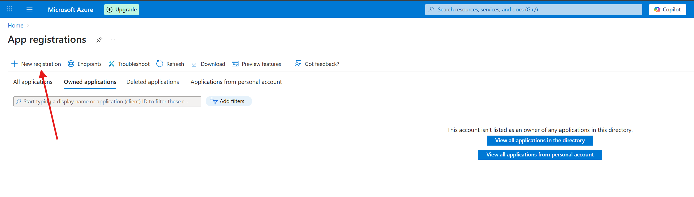 

* Ponemos el nombre deseado y completamos la creación del recurso:

    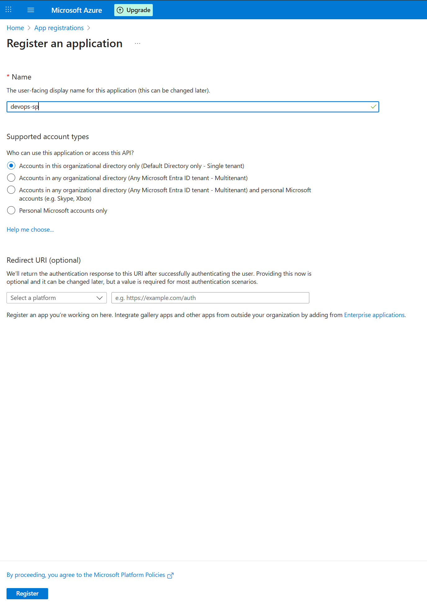

* Una vez tenemos creado este recurso, podemos accerder al ARM_CLIENT_ID y al ARM_TENANT_ID como vemos a continuación:

    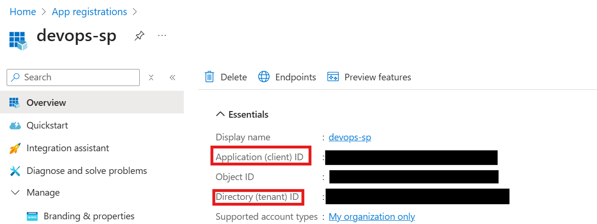

### 🔐 3. `ARM_CLIENT_SECRET`

El Client Secret es una clave privada asociada al Service Principal que funciona como su “contraseña”. Junto con el Client ID y el Tenant ID, permite que la aplicación (en este caso Terraform) se autentique de forma segura en Azure sin necesidad de usar un usuario personal.

* Este scereto lo generamos en la sección de Manage/Certificates & Secrets:

    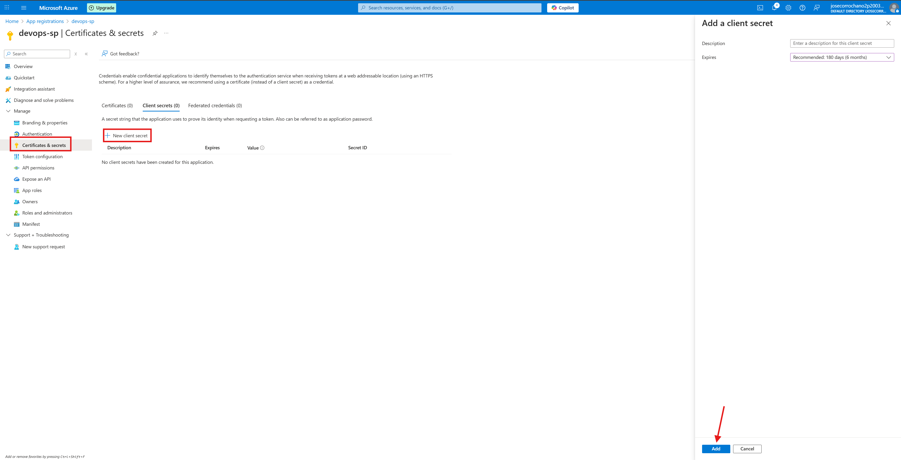

* Una vez generado, vemos nuestro ARM_CLIENT_SECRET:

    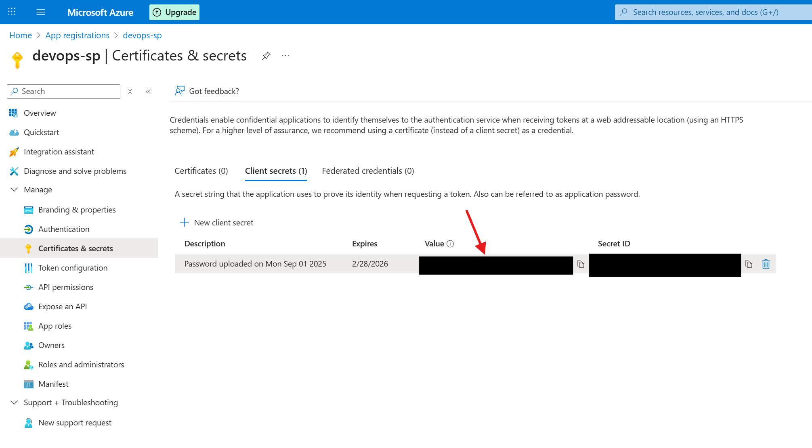

[🔝 Volver a la tabla de contenidos 🔝](#-tabla-de-contenidos) 

---

## 🛡️ 2.3 Asignar permisos al Servie Principal

Es necesario añadir permisos al **Service Principal** porque, por defecto, no tiene autorización para gestionar recursos en Azure. Al asignarle un rol (como *Contributor*), le damos los privilegios necesarios para crear, modificar y eliminar la infraestructura definida en Terraform. Sin estos permisos, aunque se autenticara correctamente, no podría realizar ninguna acción sobre la suscripción.

* Para eso tenemos que irnos dentro de nuestra suscripción y hacer lo siguiente:

    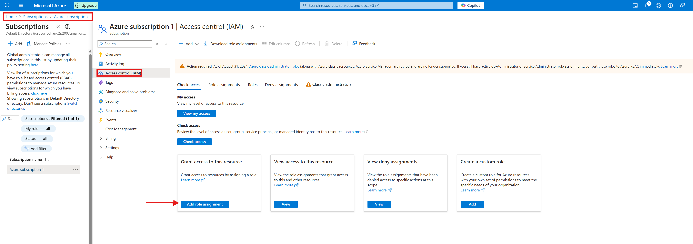

* Seleccionamos el rol de "Contributor":

    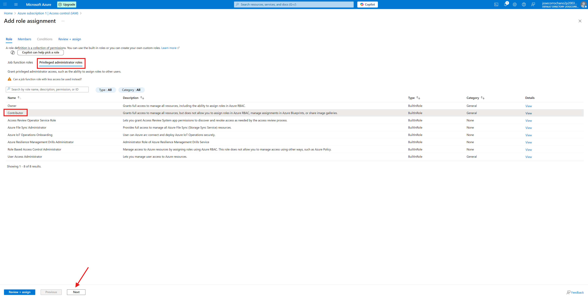

* Después añadimos nuestro service principal:

    

* Y comprobamos como ya tiene el rol necesario para poder funcionar correctamente:

    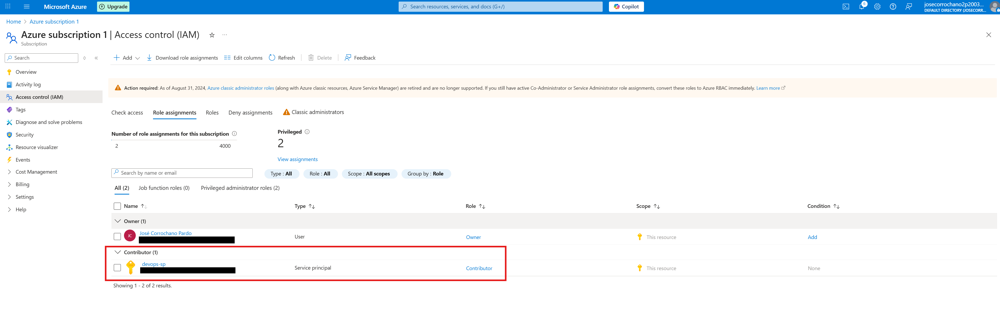

---

## 💻 2.4 Exportar credenciales como variables de entorno

Ahora que ya tenemos las 4 claves, tenemos que exportarlas como variables de entorno en nuestra máquina. Para que eso funcione automáticamente siempre que encendamos nuestra máquina, tenemos que incluirlas en el archivo `~/.bashrc`. 

* Para ello hacemos lo siguiente:

    ```bash
    sudo nano ~/.bashrc
    ```

* Y al final del archivo añadimos las siguientes líneas con nuestras claves correspondientes y guardamos el archivo:

    ```bash
    export ARM_SUBSCRIPTION_ID="..."
    export ARM_CLIENT_ID="..."
    export ARM_TENANT_ID="..."
    export ARM_CLIENT_SECRET="..."
    ```

* Aplicamos los cambios sin reiniciar el terminal:

    ```bash
    source ~/.bashrc
    ```

---

Con esto, ya tendríamos nuestra máquina configurada con las credenciales necesarias y listas como variables de entorno, lo que permitirá que Terraform y el resto de herramientas de automatización puedan autenticarse correctamente en Azure. Además, ya contamos con todos los recursos previos creados (grupo de recursos, storage account, contenedor y ACR), por lo que el entorno está preparado para empezar a escribir y ejecutar el código de Terraform.

---

## 📦 2.5 Publicación de imágenes Docker en ACR

En este apartado se va a explicar cómo **publicar imágenes Docker en Azure Container Registry (ACR)**. Este proceso es fundamental porque permite almacenar y gestionar imágenes de contenedores en un repositorio privado en la nube, lo que facilita su despliegue posterior en servicios como Azure Kubernetes Service (AKS) o Azure App Service.

El objetivo de publicar las imágenes en ACR es centralizar y asegurar el acceso a las mismas, evitando tenerlas únicamente en local y garantizando que cualquier entorno de producción o desarrollo pueda utilizarlas de forma controlada.

Para ello, se realizará el proceso mediante comandos en la terminal:

* Iniciar sesión en Azure

  ```bash
  az login
  ```

* Iniciar sesión en el ACR (Teniendo el Docker Desktop iniciado)

  ```bash
  az acr login --name acrjosecp03devops
  ```

* Etiquetar la imagen Docker de mi frontend con la dirección del ACR

  ```bash
  docker tag frontend:latest acrjosecp03devops.azurecr.io/frontend:1.0.0
  ```

* Etiquetar la imagen Docker de mi backend con la dirección del ACR

  ```bash
  docker tag backend:latest acrjosecp03devops.azurecr.io/backend:1.0.0
  ```

* Publicar (push) la imagen de mi frontend al ACR

  ```bash
  docker push acrjosecp03devops.azurecr.io/frontend:1.0.0
  ```

* Publicar (push) la imagen de mi backend al ACR

  ```bash
  docker push acrjosecp03devops.azurecr.io/backend:1.0.0
  ```

Con estos pasos, la imagen quedará almacenada en el registro privado de Azure lista para ser usada en despliegues posteriores:


[🔝 Volver a la tabla de contenidos 🔝](#-tabla-de-contenidos) 
