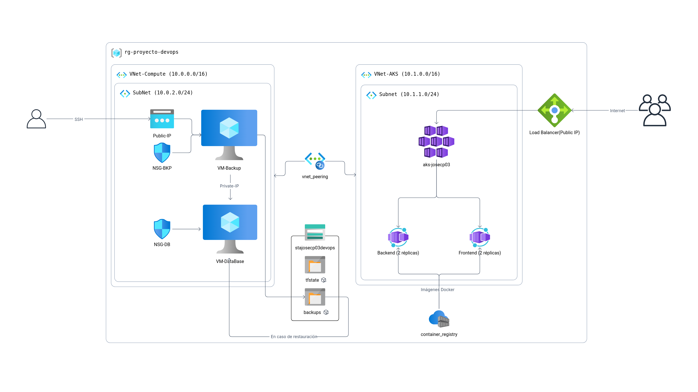
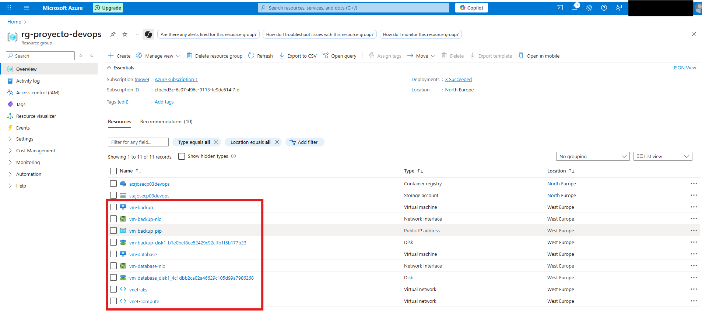

# 🧱 Paso 3 - Terraform (Infraestructura como código)

Terraform es una herramienta de **infraestructura como código (IaC)** que nos permite definir, desplegar y gestionar recursos en la nube de forma automática y repetible mediante archivos de configuración. En este caso, la vamos a usar para crear toda la infraestructura como redes, máquinas virtuales, clúster AKS. Todo esto se alojará en **Azure**, aprovechando los recursos que ya hemos creado previamente (Storage Account, contenedor `tfstate` y ACR), lo que permite que Terraform gestione la infraestructura de manera segura, modular y consistente. Por eso este paso se incluye aquí: para preparar y desplegar automáticamente todo lo necesario en Azure antes de pasar a los siguientes pasos del proyecto.

## 📋 Tabla de contenidos

- [🧱 Paso 3 - Terraform (Infraestructura como código)](#-paso-3---terraform-infraestructura-como-código)
  - [📋 Tabla de contenidos](#-tabla-de-contenidos)
  - [🛠️ 3.1 Instalación Terraform](#️-31-instalación-terraform)
  - [🗺️ 3.2 Esquema de infraestructura](#️-32-esquema-de-infraestructura)
    - [🧩 Resource Group](#-resource-group)
    - [🌐 Redes Virtuales (VNets)](#-redes-virtuales-vnets)
    - [🖥️ Subnet DB (VNet-Compute)](#️-subnet-db-vnet-compute)
    - [🧱 Subnet AKS (VNet-AKS)](#-subnet-aks-vnet-aks)
    - [📦 Azure Container Registry (ACR)](#-azure-container-registry-acr)
    - [☁️ Azure Storage Account](#️-azure-storage-account)
    - [✅ Puntos clave del diseño](#-puntos-clave-del-diseño)
  - [📂 3.3 Estructura de archivos](#-33-estructura-de-archivos)
  - [🗂️ 3.4 Archivos terraform](#️-34-archivos-terraform)
    - [🚀 3.4.1 Archivos raíz](#-341-archivos-raíz)
      - [`backend.tf`](#backendtf)
      - [`variables.tf`](#variablestf)
      - [`terraform.tfvars`](#terraformtfvars)
      - [`main.tf`](#maintf)
      - [`outputs.tf`](#outputstf)
    - [🌐 3.4.2 Módulo networking](#-342-módulo-networking)
      - [`modules/networking/main.tf`](#modulesnetworkingmaintf)
      - [`modules/networking/variables.tf`](#modulesnetworkingvariablestf)
      - [`modules/networking/outputs.tf`](#modulesnetworkingoutputstf)
    - [🖥️ 3.4.3 Módulo compute](#️-343-módulo-compute)
      - [`modules/compute/main.tf`](#modulescomputemaintf)
      - [`modules/compute/variables.tf`](#modulescomputevariablestf)
      - [`modules/compute/outputs.tf`](#modulescomputeoutputstf)
    - [🔗 3.4.4 Módulo peering](#-344-módulo-peering)
      - [`modules/peering/main.tf`](#modulespeeringmaintf)
      - [`modules/peering/variables.tf`](#modulespeeringvariablestf)
      - [`modules/peering/outputs.tf`](#modulespeeringoutputstf)
    - [☸️ 3.4.5 Módulo aks](#️-345-módulo-aks)
      - [`modules/aks/main.tf`](#modulesaksmaintf)
      - [`modules/aks/variables.tf`](#modulesaksvariablestf)
      - [`modules/aks/outputs.tf`](#modulesaksoutputstf)
  - [🚀 3.5 Desplegar la infraestructura](#-35-desplegar-la-infraestructura)

---

## 🛠️ 3.1 Instalación Terraform

* Para instalar la versión más reciente de terraform debemos descargar el binario de Terraform desde HashiCorp:

    ```bash
    wget https://releases.hashicorp.com/terraform/1.13.1/terraform_1.13.1_linux_amd64.zip
    ```

* Instalar unzip si no lo tenemos ya instalado:

    ```bash
    sudo apt install unzip
    ```

* Descomprimir el archivo:

    ```bash
    unzip terraform_1.13.1_linux_amd64.zip
    ```

* Mover el binario a /usr/local/bin para que esté disponible en todo el sistema:

    ```bash     
    sudo mv terraform /usr/local/bin/
    ```

* Y comprobar que se ha instalado correctamente:

    ```bash
    terraform --version
    ```

[🔝 Volver a la tabla de contenidos 🔝](#-tabla-de-contenidos) 

---

## 🗺️ 3.2 Esquema de infraestructura

Para definir la infraestructura de este proyecto me apoyé en la herramienta [BrainBoard](https://braiboard.com/), lo que me permitió organizar visualmente los distintos componentes de la solución y cómo se relacionan entre sí. A partir de esa planificación elaboré un esquema propio que refleja con claridad la arquitectura que se va a desplegar en Azure.

En el diseño se pueden observar los principales elementos: dos redes virtuales interconectadas mediante peering, las máquinas virtuales para base de datos y backup, el clúster de Kubernetes (AKS), el balanceador de carga, el registro de contenedores (ACR) y la cuenta de almacenamiento. Todo ello se encuentra centralizado bajo un único grupo de recursos, lo que facilita la gestión y la trazabilidad del entorno.



A continuación, se detallan los distintos bloques que conforman la infraestructura:

### 🧩 Resource Group

Toda la infraestructura se encuentra dentro de un único **Resource Group de Azure**, lo que simplifica la administración, el despliegue y, en caso necesario, la eliminación de todos los recursos de forma ordenada.

### 🌐 Redes Virtuales (VNets)

La arquitectura utiliza **dos VNets separadas** para organizar mejor las cargas de trabajo:

- **VNet-Compute (10.0.0.0/16):** contiene las máquinas virtuales de base de datos y backup.  
- **VNet-AKS (10.1.0.0/16):** reservada exclusivamente para el clúster de Kubernetes.  

Ambas VNets están interconectadas mediante **VNet Peering**, lo que permite la comunicación privada y segura entre ellas sin exponer recursos sensibles a Internet.

### 🖥️ Subnet DB (VNet-Compute)
  
Dentro de la **VNet-Compute** se encuentra la **subnet DB (10.0.2.0/24)**, que incluye:

- **VM Database (PostgreSQL):** aloja la base de datos del sistema. Solo tiene IP privada, de modo que únicamente puede ser accedida desde la red interna.  
  
- **VM Backup / Disaster Recovery:** actúa como jump server. Tiene IP pública para acceso remoto por SSH y IP privada para comunicarse con la base de datos.

**Seguridad (NSG)**

- **NSG-DB:** solo permite conexiones internas (SSH y PostgreSQL desde 10.0.2.0/24).  
- **NSG-BKP:** permite SSH (22) desde cualquier origen, ya que es el punto de acceso externo a la infraestructura.  

De este modo, toda la administración remota pasa primero por la VM de backup y nunca directamente contra la base de datos.

### 🧱 Subnet AKS (VNet-AKS) 
  
En la **subnet AKS (10.1.1.0/24)** se despliega el clúster de **Azure Kubernetes Service (AKS)**, donde se ejecutan los servicios de la aplicación:  

- **Pods frontend:** 2 réplicas.  
- **Pods backend:** 2 réplicas.  

El tráfico externo llega al clúster a través de un **Load Balancer con IP pública**, que distribuye las peticiones entre los pods.  
El **VNet Peering** garantiza que AKS puede acceder directamente a la base de datos sin necesidad de exponerla públicamente.

> El Load Balancer es un servicio que reparte automáticamente el tráfico entre varios recursos (en este caso, los pods de AKS) para mejorar disponibilidad y rendimiento; aquí tiene IP pública para recibir peticiones externas sin exponer la base de datos.

### 📦 Azure Container Registry (ACR)
  
El **ACR** se utiliza para almacenar y distribuir las imágenes Docker. 

- Las imágenes se construyen con GitHub Actions (También se pueden construir y publicar desde la terminal en local) y se publican en el registro.  
- Posteriormente, AKS descarga y ejecuta dichas imágenes en los pods.  

Este desacoplamiento asegura un flujo CI/CD seguro y eficiente.

> El flujo CI/CD automatiza la construcción, prueba y despliegue de la aplicación, asegurando que los cambios lleguen de forma controlada y rápida a los entornos de ejecución; más adelante profundizaremos en cómo se implementa concretamente en este proyecto.

### ☁️ Azure Storage Account
  
El **Storage Account** cumple un papel crítico en la infraestructura:  

- Contenedor `tfstate`: almacena el archivo de estado de Terraform, necesario para gestionar la infraestructura como código de manera consistente y colaborativa.
- Contenedor `backups`: guarda copias de seguridad de la base de datos y de las VMs. En caso de fallo o desastre, estas copias pueden restaurarse de forma rápida, garantizando continuidad de servicio. 

De esta forma, el almacenamiento asegura persistencia, trazabilidad y recuperación ante desastres, centralizando tanto la configuración de la infraestructura como los datos críticos del sistema.

### ✅ Puntos clave del diseño
  
- Solo la **VM de backup** y el **Load Balancer de AKS** tienen IP pública.  
- Todo lo demás queda en red privada, protegido por las VNets y el peering.  
- La seguridad de acceso está reforzada con NSGs y el uso de un **jump server** (VM backup). 

---

## 📂 3.3 Estructura de archivos

En este apartado se presenta la estructura de los archivos de Terraform utilizada en el proyecto, mostrando cómo se han organizado los distintos ficheros y carpetas para gestionar de forma ordenada y modular la infraestructura de Azure.

```
Deploy-DevOps-App/
└── iac/
    ├── backend.tf                      ← Configuración del backend remoto (Azure Storage)
    ├── main.tf                         ← Llamadas a módulos (networking, compute, aks, peering)
    ├── outputs.tf                      ← Salidas (outputs) finales de Terraform
    ├── variables.tf                    ← Definición de variables globales
    ├── terraform.tfvars                ← Valores por defecto (Oculto en GitHub)
    └── modules/                        ← Carpeta de módulos reutilizables
        ├── networking/
        │   ├── main.tf                 ← Crea VNet + subnets 
        │   ├── variables.tf            ← Variables específicas de networking
        │   └── outputs.tf              ← Salidas: vnet_compute_id, vnet_aks_id, subnet_db_id, subnet_aks_id
        ├── compute/
        │   ├── main.tf                 ← Crea las dos VMs (DB y Backup) + NICs
        │   ├── variables.tf            ← Variables específicas de compute
        │   └── outputs.tf              ← Salidas: vm_db_private_ip, vm_bkp_private_ip, vm_bkp_public_ip, db_nsg_id, bkp_nsg_id
        ├── peering/
        │   ├── main.tf                 ← Configura el VNet Peering entre VNets
        │   ├── variables.tf            ← Variables del peering
        │   └── outputs.tf              ← Salidas: peering_compute_to_aks_id, peering_aks_to_compute_id
        ├── aks/
        │   ├── main.tf                 ← Crea el clúster AKS 
        │   ├── variables.tf            ← Variables específicas de AKS
        │   └── outputs.tf              ← Salidas: cluster_name, kube_config
        └──
```

[🔝 Volver a la tabla de contenidos 🔝](#-tabla-de-contenidos) 

---

## 🗂️ 3.4 Archivos terraform

A continuación se muestran **todos** los archivos **.tf** que forman la infraestructura de Terraform, respetando la jerarquía de carpetas y módulos.

### 🚀 3.4.1 Archivos raíz

#### `backend.tf` 

Define la versión mínima de Terraform, el proveedor `azurerm` y el backend remoto en Azure Blob Storage.

```hcl
terraform {
  required_version = ">= 1.1.0"

  required_providers {
    azurerm = {
      source  = "hashicorp/azurerm"
      version = "~> 3.0"
    }
  }

  backend "azurerm" {
    resource_group_name  = "rg-proyecto-devops"
    storage_account_name = "stajosecp03devops"
    container_name       = "tfstate"
    key                  = "infrastructure.tfstate"
  }
}

provider "azurerm" {
  features {}
}
```

---

#### `variables.tf` 

Contiene las variables globales.

```hcl
# General
variable "location" { type = string }
variable "rg_name"  { type = string }

# Compute VNet
variable "vnet_compute_name" { type = string }
variable "vnet_compute_cidr" { type = string }
variable "subnet_db_name"    { type = string }
variable "subnet_db_cidr"    { type = string }

# AKS VNet
variable "vnet_aks_name"    { type = string }
variable "vnet_aks_cidr"    { type = string }
variable "subnet_aks_name"  { type = string }
variable "subnet_aks_cidr"  { type = string }

# VMs
variable "vm_db_name"       { type = string }
variable "vm_bkp_name"      { type = string }
variable "vm_admin_user"    { type = string }
variable "ssh_public_key"   { type = string }

# AKS
variable "aks_name"         { type = string }
variable "aks_node_count"   { type = number }
variable "aks_node_vm_size" { type = string }
```

---

#### `terraform.tfvars` 

Se definen valores por defecto que suelen aplicarse en la mayoría de los casos.

```hcl
# General
location             = "westeurope"
rg_name              = "rg-proyecto-devops"

# VNet Compute
vnet_compute_name    = "vnet-compute"
vnet_compute_cidr    = "10.0.0.0/16"
subnet_db_name       = "subnet-db"
subnet_db_cidr       = "10.0.2.0/24"

# VNet AKS
vnet_aks_name        = "vnet-aks"
vnet_aks_cidr        = "10.1.0.0/16"
subnet_aks_name      = "subnet-aks"
subnet_aks_cidr      = "10.1.1.0/24"

# VMs
vm_db_name           = "vm-database"
vm_bkp_name          = "vm-backup"
vm_admin_user        = "josecp03"
ssh_public_key       = "ssh-rsa AAAAB3NzaC1y..."

# AKS
aks_name             = "aks-josecp03"
aks_node_count       = 2
aks_node_vm_size     = "Standard_B2s"
```

---

#### `main.tf` 

Este archivo hace de orquestador: lee el Resource Group, luego invoca a cada submódulo.

```hcl
data "azurerm_resource_group" "rg" {
  name = var.rg_name
}

module "networking" {
  source            = "./modules/networking"
  location          = var.location
  resource_group    = data.azurerm_resource_group.rg.name
  vnet_compute_name = var.vnet_compute_name
  vnet_compute_cidr = var.vnet_compute_cidr
  subnet_db_name    = var.subnet_db_name
  subnet_db_cidr    = var.subnet_db_cidr
  vnet_aks_name     = var.vnet_aks_name
  vnet_aks_cidr     = var.vnet_aks_cidr
  subnet_aks_name   = var.subnet_aks_name
  subnet_aks_cidr   = var.subnet_aks_cidr
}

module "peering" {
  source         = "./modules/peering"
  resource_group = data.azurerm_resource_group.rg.name
  vnet_compute_id = module.networking.vnet_compute_id
  vnet_aks_id     = module.networking.vnet_aks_id
}

module "compute" {
  source           = "./modules/compute"
  location         = var.location
  resource_group   = data.azurerm_resource_group.rg.name
  subnet_db_id     = module.networking.subnet_db_id
  vm_db_name       = var.vm_db_name
  vm_bkp_name      = var.vm_bkp_name
  admin_user       = var.vm_admin_user
  ssh_public_key   = var.ssh_public_key
}

module "aks" {
  source             = "./modules/aks"
  location           = var.location
  resource_group     = data.azurerm_resource_group.rg.name
  cluster_name       = var.aks_name
  node_count         = var.aks_node_count
  node_vm_size       = var.aks_node_vm_size
  subnet_aks_id      = module.networking.subnet_aks_id
}
```

---

#### `outputs.tf` 

Recolecta los valores “útiles” que quiero consultar al final, una vez terminado el `apply`.

```hcl
output "vm_db_private_ip" {
  value       = module.compute.vm_db_private_ip
  description = "IP privada de la VM de base de datos"
}

output "vm_bkp_public_ip" {
  value       = module.compute.vm_bkp_public_ip
  description = "IP pública de la VM de backup (jump server)"
}

output "aks_kubeconfig" {
  value       = module.aks.kube_config
  description = "Kubeconfig del clúster AKS"
  sensitive   = true
}
```

[🔝 Volver a la tabla de contenidos 🔝](#-tabla-de-contenidos) 

---

### 🌐 3.4.2 Módulo networking

#### `modules/networking/main.tf` 

```hcl
# VNet para Compute
resource "azurerm_virtual_network" "compute" {
  name                = var.vnet_compute_name
  address_space       = [var.vnet_compute_cidr]
  location            = var.location
  resource_group_name = var.resource_group
}

resource "azurerm_subnet" "db" {
  name                 = var.subnet_db_name
  resource_group_name  = var.resource_group
  virtual_network_name = azurerm_virtual_network.compute.name
  address_prefixes     = [var.subnet_db_cidr]
}

# VNet para AKS
resource "azurerm_virtual_network" "aks" {
  name                = var.vnet_aks_name
  address_space       = [var.vnet_aks_cidr]
  location            = var.location
  resource_group_name = var.resource_group
}

resource "azurerm_subnet" "aks" {
  name                 = var.subnet_aks_name
  resource_group_name  = var.resource_group
  virtual_network_name = azurerm_virtual_network.aks.name
  address_prefixes     = [var.subnet_aks_cidr]
}
```

---

#### `modules/networking/variables.tf` 

```hcl
variable "location"          { type = string }
variable "resource_group"    { type = string }

variable "vnet_compute_name" { type = string }
variable "vnet_compute_cidr" { type = string }
variable "subnet_db_name"    { type = string }
variable "subnet_db_cidr"    { type = string }

variable "vnet_aks_name"     { type = string }
variable "vnet_aks_cidr"     { type = string }
variable "subnet_aks_name"   { type = string }
variable "subnet_aks_cidr"   { type = string }
```

---

#### `modules/networking/outputs.tf` 

```hcl
output "vnet_compute_id" { value = azurerm_virtual_network.compute.id }
output "vnet_aks_id"     { value = azurerm_virtual_network.aks.id }

output "subnet_db_id"  { value = azurerm_subnet.db.id }
output "subnet_aks_id" { value = azurerm_subnet.aks.id }
```

[🔝 Volver a la tabla de contenidos 🔝](#-tabla-de-contenidos) 

---

### 🖥️ 3.4.3 Módulo compute

#### `modules/compute/main.tf` 

```hcl
# NSG para VM Backup (acceso público)
resource "azurerm_network_security_group" "bkp_nsg" {
  name                = "nsg-${var.vm_bkp_name}"
  location            = var.location
  resource_group_name = var.resource_group

  security_rule {
    name                       = "Allow-SSH-External"
    priority                   = 1000
    direction                  = "Inbound"
    access                     = "Allow"
    protocol                   = "Tcp"
    source_port_range          = "*"
    destination_port_range     = "*"
    source_address_prefix      = "*"
    destination_address_prefix = "*"
  }

  tags = {
    Environment = "Development"
    Purpose     = "Backup-VM-Access"
  }
}

# NSG para VM Database (solo interno)
resource "azurerm_network_security_group" "db_nsg" {
  name                = "nsg-${var.vm_db_name}"
  location            = var.location
  resource_group_name = var.resource_group

  security_rule {
    name                       = "Allow-SSH-Internal"
    priority                   = 1000
    direction                  = "Inbound"
    access                     = "Allow"
    protocol                   = "Tcp"
    source_port_range          = "*"
    destination_port_range     = "22"
    source_address_prefix      = "10.0.2.0/24"
    destination_address_prefix = "*"
  }

  security_rule {
    name                       = "Allow-MySQL"
    priority                   = 1001
    direction                  = "Inbound"
    access                     = "Allow"
    protocol                   = "Tcp"
    source_port_range          = "*"
    destination_port_range     = "3306"
    source_address_prefix      = "10.0.2.0/24"
    destination_address_prefix = "*"
  }

  security_rule {
    name                       = "Allow-PostgreSQL"
    priority                   = 1002
    direction                  = "Inbound"
    access                     = "Allow"
    protocol                   = "Tcp"
    source_port_range          = "*"
    destination_port_range     = "5432"
    source_address_prefix      = "10.0.2.0/24"
    destination_address_prefix = "*"
  }

  tags = {
    Environment = "Development"
    Purpose     = "Database-VM-Internal"
  }
}

# IP pública para VM Backup
resource "azurerm_public_ip" "bkp" {
  name                = "${var.vm_bkp_name}-pip"
  location            = var.location
  resource_group_name = var.resource_group
  allocation_method   = "Static"
  sku                 = "Standard"
}

# NIC Database (solo privada)
resource "azurerm_network_interface" "db" {
  name                = "${var.vm_db_name}-nic"
  location            = var.location
  resource_group_name = var.resource_group

  ip_configuration {
    name                          = "internal"
    subnet_id                     = var.subnet_db_id
    private_ip_address_allocation = "Static"
    private_ip_address            = "10.0.2.5"
  }
}

# NIC Backup (pública + privada)
resource "azurerm_network_interface" "bkp" {
  name                = "${var.vm_bkp_name}-nic"
  location            = var.location
  resource_group_name = var.resource_group

  ip_configuration {
    name                          = "internal"
    subnet_id                     = var.subnet_db_id
    private_ip_address_allocation = "Dynamic"
    public_ip_address_id          = azurerm_public_ip.bkp.id
  }
}

# Asociaciones NSG
resource "azurerm_network_interface_security_group_association" "db_nsg_assoc" {
  network_interface_id      = azurerm_network_interface.db.id
  network_security_group_id = azurerm_network_security_group.db_nsg.id
}

resource "azurerm_network_interface_security_group_association" "bkp_nsg_assoc" {
  network_interface_id      = azurerm_network_interface.bkp.id
  network_security_group_id = azurerm_network_security_group.bkp_nsg.id
}

# VM Database
resource "azurerm_linux_virtual_machine" "db" {
  name                   = var.vm_db_name
  location               = var.location
  resource_group_name    = var.resource_group
  size                   = "Standard_B2s"
  admin_username         = var.admin_user
  network_interface_ids  = [azurerm_network_interface.db.id]

  os_disk {
    caching              = "ReadWrite"
    storage_account_type = "Standard_LRS"
  }

  source_image_reference {
    publisher = "Canonical"
    offer     = "0001-com-ubuntu-server-jammy"
    sku       = "22_04-lts-gen2"
    version   = "latest"
  }

  admin_ssh_key {
    username   = var.admin_user
    public_key = var.ssh_public_key
  }

  depends_on = [azurerm_network_interface_security_group_association.db_nsg_assoc]
}

# VM Backup
resource "azurerm_linux_virtual_machine" "bkp" {
  name                   = var.vm_bkp_name
  location               = var.location
  resource_group_name    = var.resource_group
  size                   = "Standard_B2s"
  admin_username         = var.admin_user
  network_interface_ids  = [azurerm_network_interface.bkp.id]

  os_disk {
    caching              = "ReadWrite"
    storage_account_type = "Standard_LRS"
  }

  source_image_reference {
    publisher = "Canonical"
    offer     = "0001-com-ubuntu-server-jammy"
    sku       = "22_04-lts-gen2"
    version   = "latest"
  }

  admin_ssh_key {
    username   = var.admin_user
    public_key = var.ssh_public_key
  }

  depends_on = [azurerm_network_interface_security_group_association.bkp_nsg_assoc]
}

# Generar archivo de configuración SSH
resource "local_file" "ssh_config" {
  content = <<EOT
Host vm-bkp
  HostName ${azurerm_public_ip.bkp.ip_address}
  User ${var.admin_user}
  IdentityFile ~/.ssh/id_rsa

Host vm-db
  HostName ${azurerm_linux_virtual_machine.db.private_ip_address}
  User ${var.admin_user}
  ProxyJump vm-bkp
  IdentityFile ~/.ssh/id_rsa
EOT

  filename = "/home/${var.admin_user}/.ssh/config"
}
```
> Al final del archivo de Terraform, este bloque genera automáticamente un archivo SSH en tu máquina, sobrescribiendo cualquier configuración previa. Gracias a ello, con un solo comando puedes conectarte a la VM de backup y a la base de datos sin necesidad de configurar nada manualmente.


---

#### `modules/compute/variables.tf` 

```hcl
variable "location"       { type = string }
variable "resource_group" { type = string }
variable "subnet_db_id"   { type = string }
variable "vm_db_name"     { type = string }
variable "vm_bkp_name"    { type = string }
variable "admin_user"     { type = string }
variable "ssh_public_key" { type = string }
```

---

#### `modules/compute/outputs.tf` 

```hcl
output "vm_db_private_ip"  { value = azurerm_network_interface.db.private_ip_address }
output "vm_bkp_private_ip" { value = azurerm_network_interface.bkp.private_ip_address }
output "vm_bkp_public_ip"  { value = azurerm_public_ip.bkp.ip_address }
output "db_nsg_id"         { value = azurerm_network_security_group.db_nsg.id }
output "bkp_nsg_id"        { value = azurerm_network_security_group.bkp_nsg.id }
```

---

### 🔗 3.4.4 Módulo peering

#### `modules/peering/main.tf` 

```hcl
resource "azurerm_virtual_network_peering" "compute_to_aks" {
  name                      = "peer-compute-to-aks"
  resource_group_name       = var.resource_group
  virtual_network_name      = basename(var.vnet_compute_id)
  remote_virtual_network_id = var.vnet_aks_id
  allow_forwarded_traffic   = true
  allow_virtual_network_access = true
}

resource "azurerm_virtual_network_peering" "aks_to_compute" {
  name                      = "peer-aks-to-compute"
  resource_group_name       = var.resource_group
  virtual_network_name      = basename(var.vnet_aks_id)
  remote_virtual_network_id = var.vnet_compute_id
  allow_forwarded_traffic   = true
  allow_virtual_network_access = true
}
```

---

#### `modules/peering/variables.tf` 

```hcl
variable "resource_group"  { type = string }
variable "vnet_compute_id" { type = string }
variable "vnet_aks_id"     { type = string }
```

---

#### `modules/peering/outputs.tf` 

```hcl
output "peering_compute_to_aks_id" { value = azurerm_virtual_network_peering.compute_to_aks.id }
output "peering_aks_to_compute_id" { value = azurerm_virtual_network_peering.aks_to_compute.id }
```

---

### ☸️ 3.4.5 Módulo aks

La parte del clúster AKS se encuentra comentada por el momento debido a las limitaciones de la suscripción gratuita de Azure, que impiden desplegar este recurso. Como se explicó anteriormente, para poder seguir avanzando en el proyecto se están levantando únicamente las máquinas virtuales, mientras que el clúster se probará de forma local con Minikube o en el futuro con una suscripción de pago.

#### `modules/aks/main.tf` 

```hcl
resource "azurerm_kubernetes_cluster" "aks" {
  name                = var.cluster_name
  location            = var.location
  resource_group_name = var.resource_group
  dns_prefix          = "${var.cluster_name}-dns"

  default_node_pool {
    name                = "default"
    node_count          = var.node_count
    vm_size             = var.node_vm_size
    vnet_subnet_id      = var.subnet_aks_id
    type                = "VirtualMachineScaleSets"
    enable_auto_scaling = false
  }

  identity {
    type = "SystemAssigned"
  }

  network_profile {
    network_plugin    = "azure"
    load_balancer_sku = "standard"
    outbound_type     = "loadBalancer"
  }
}
```

---

#### `modules/aks/variables.tf` 

```hcl
variable "location"        { type = string }
variable "resource_group"  { type = string }

variable "cluster_name"    { type = string }
variable "node_count"      { type = number }
variable "node_vm_size"    { type = string }
variable "subnet_aks_id"   { type = string }
```

---

#### `modules/aks/outputs.tf` 

```hcl
output "cluster_name" {
    value = azurerm_kubernetes_cluster.aks.name
}

output "kube_config" {
    value     = azurerm_kubernetes_cluster.aks.kube_config_raw
    sensitive = true
}
```

[🔝 Volver a la tabla de contenidos 🔝](#-tabla-de-contenidos) 

---

## 🚀 3.5 Desplegar la infraestructura

En esta sección se muestra cómo levantar la infraestructura explicada anteriormente utilizando Terraform de manera sencilla. Se detallan los pasos básicos que permiten preparar el entorno, revisar los cambios previstos, desplegar los recursos y, cuando ya no son necesarios, eliminarlos de forma segura para evitar costes innecesarios.

Los comandos principales que hay que seguir para desplegar esta infraestructura son los siguinetes:

```bash
terraform init
```

> Prepara el directorio de trabajo, descarga los proveedores necesarios y configura el backend remoto.

```bash
terraform plan
```

> Muestra un resumen de los cambios que se aplicarán sin modificar nada todavía, permitiendo verificar que todo está correcto.

```bash
terraform apply
```

> Aplica los cambios planificados, creando realmente la infraestructura. Durante su ejecución se muestran los outputs definidos, como las IPs de las VMs, para poder acceder a ellas.

```bash
terraform destroy
```

> Elimina todos los recursos desplegados (VMs, redes, peering, etc.), liberando los servicios de Azure y reduciendo costes cuando ya no se necesitan.

Cuando ejecutamos el terraform apply podemos ver como se crean todos los recursos:



[🔝 Volver a la tabla de contenidos 🔝](#-tabla-de-contenidos) 


