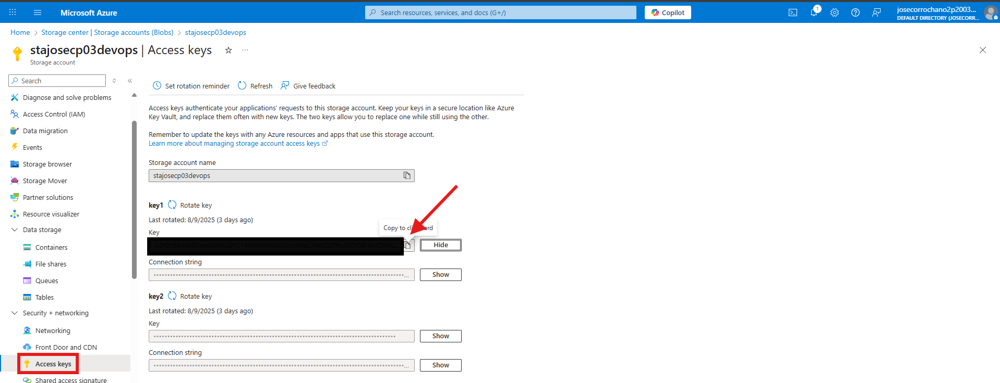

# ⚙️ Paso 4 - Ansible (Automatización de despliegues)

Ansible es una herramienta de automatización que permite gestionar configuraciones y desplegar servicios de forma sencilla mediante ficheros declarativos. En este proyecto lo utilizo para preparar la máquina de copias de seguridad y la máquina de base de datos, asegurando que ambas tengan la configuración necesaria sin tener que hacerlo manualmente en cada servidor.

## 📋 Tabla de contenidos
- [⚙️ Paso 4 - Ansible (Automatización de despliegues)](#️-paso-4---ansible-automatización-de-despliegues)
  - [📋 Tabla de contenidos](#-tabla-de-contenidos)
  - [💻 4.1 Instalación Ansible](#-41-instalación-ansible)
  - [🔑 4.2 Comprobación de acceso a las máquinas](#-42-comprobación-de-acceso-a-las-máquinas)
  - [🛠️ 4.3 Tareas a automatizar con Ansible](#️-43-tareas-a-automatizar-con-ansible)
  - [📂 4.4 Estructura de archivos](#-44-estructura-de-archivos)
  - [📂 4.5 Archivos de Ansible](#-45-archivos-de-ansible)
    - [🚀 4.5.1 Archivos raíz](#-451-archivos-raíz)
      - [`ansible.cfg`](#ansiblecfg)
      - [`requeriments.yml`](#requerimentsyml)
    - [🗂️ 4.5.2 Inventories](#️-452-inventories)
      - [`inventories/dev/inventory.ini`](#inventoriesdevinventoryini)
      - [`inventories/dev/group_vars/all.yml`](#inventoriesdevgroup_varsallyml)
      - [`inventories/dev/group_vars/backups.yml`](#inventoriesdevgroup_varsbackupsyml)
      - [`inventories/dev/group_vars/database.yml`](#inventoriesdevgroup_varsdatabaseyml)
      - [`inventories/dev/group_vars/vault.yml`](#inventoriesdevgroup_varsvaultyml)
    - [📜 4.5.2 Playbooks](#-452-playbooks)
      - [`playbooks/bkp.yml`](#playbooksbkpyml)
      - [`playbooks/db.yml`](#playbooksdbyml)
      - [`playbooks/dr.yml`](#playbooksdryml)
    - [👤 4.5.3 roles](#-453-roles)
      - [`roles/backup/tasks/main.yml`](#rolesbackuptasksmainyml)
      - [`roles/dr_test/tasks/main.yml`](#rolesdr_testtasksmainyml)
      - [`roles/mysql/tasks/main.yml`](#rolesmysqltasksmainyml)
      - [`roles/mysql/templates/mysqld.conf.j2`](#rolesmysqltemplatesmysqldconfj2)
      - [`roles/mysql/handlers/main.yml`](#rolesmysqlhandlersmainyml)
  - [⚙️ 4.6 Preparación entorno Ansible](#️-46-preparación-entorno-ansible)
  - [🚀 4.7 Lanzar playbooks](#-47-lanzar-playbooks)
    - [✅ 4.7.1 Probar conexión](#-471-probar-conexión)
    - [🛠️ 4.7.2 Configuración de MySQL en la VM de base de datos](#️-472-configuración-de-mysql-en-la-vm-de-base-de-datos)
    - [💾 4.7.2 Automatización de backups de la BBDD](#-472-automatización-de-backups-de-la-bbdd)
    - [🔄 4.7.3 Automatización de backups de la BBDD](#-473-automatización-de-backups-de-la-bbdd)

---

## 💻 4.1 Instalación Ansible

A continuación voy a detallar el proceso de instalación de Ansible Core en la versión 2.17.8. He decidido usar esta versión concreta porque, tras varias pruebas, es la que mejor se adapta a mi infraestructura con Terraform y evita problemas al conectarme a las máquinas y ejecutar tareas. Para la instalación se utiliza Python3 junto con pip, que es el gestor de paquetes de Python y permite instalar Ansible de forma sencilla en el entorno del usuario. Además, es necesario añadir la carpeta local al PATH para que el sistema pueda reconocer y ejecutar los comandos de Ansible desde cualquier ubicación. De esta manera, la herramienta quedará correctamente configurada y lista para usarse.

* Primero actualizamos el sistema:

    ```bash
    sudo apt update && sudo apt upgrade -y
    ```

* Después instalamos Python3, pip y dependencias necesarias:

    ```bash
    sudo apt install -y python3 python3-pip python3-venv
    ```

* Instalamos Ansible Core en la versión 2.17.:

    ```bash
    python3 -m pip install --user ansible-core==2.17.8
    ```

* Añadimos la ruta local al PATH:

    ```bash     
    echo 'export PATH=$HOME/.local/bin:$PATH' >> ~/.bashrc
    source ~/.bashrc
    ```

* Verificamos la instalación:

    ```bash
    ansible --version
    ```

---

## 🔑 4.2 Comprobación de acceso a las máquinas

Antes de comenzar a trabajar con Ansible, es fundamental asegurarse de que podemos acceder correctamente a las máquinas mediante SSH, ya que esta es la forma en la que Ansible se comunica con ellas para ejecutar tareas. En este caso, el acceso va a ser muy sencillo gracias al script generado previamente con Terraform, que ya deja configuradas las claves y parámetros necesarios.

* Para acceder a la máquina del backup bastaría con ejecutar el siguiente comando:

    ```bash
    ssh vm-bkp
    ```

* Para la de la base de datos mas de lo mismo:

    ```bash
    ssh vm-db
    ```

> El archivo encargado de que podamos realizar esta tarea de forma tan secilla se encuentra en `~/.ssh/config`

> ⚠️ **Advertencia:** Si ya se ha usado una máquina y luego se ha eliminado o recreado, es posible que quede almacenada la configuración SSH anterior en tu equipo. Para evitar errores de conexión, ejecuta el siguiente comando antes de volver a conectarte:  
> 
> ```bash
> ssh-keygen -f "/home/user/.ssh/known_hosts" -R "10.0.2.4"
> ```

---

## 🛠️ 4.3 Tareas a automatizar con Ansible

En esta sección voy a explicar cómo utilizar Ansible para automatizar tareas sobre las máquinas desplegadas con Terraform. El objetivo es simplificar y estandarizar la configuración y operación de los servidores, evitando tener que realizar cada paso de forma manual. Con Ansible se van a ejecutar tres tareas principales:

  1. Preparación de la máquina de base de datos: instalación y configuración completa de MySQL, dejando el servidor listo para su uso.

  2. Preparación de la máquina de backup: instalación de las herramientas necesarias y configuración de un script automatizado que realice copias de seguridad diarias a las 2:00 de la mañana.

  3. Recuperación desde backup: restauración de la base de datos utilizando el archivo de backup previamente subido, permitiendo recuperar los datos de forma rápida y segura.

Estas tareas permiten garantizar que tanto la base de datos como el sistema de backup estén siempre operativos y preparados para cualquier eventualidad.

[🔝 Volver a la tabla de contenidos 🔝](#-tabla-de-contenidos) 

---

## 📂 4.4 Estructura de archivos

A continuación se explicará la estructura y el contenido de los archivos de Ansible que se van a utilizar en el proyecto. Se detallará cómo están organizados los playbooks, roles y archivos de configuración.

```
ansible/
├── ansible.cfg                        ← Configuración global de Ansible
├── requirements.yml                   ← Roles externos o dependencias
├── inventories/
│   └── dev/
│       ├── group_vars/
│       │   ├── all.yml                 ← Variables globales
│       │   ├── backups.yml             ← Variables relacionadas con backups
│       │   ├── database.yml            ← Variables relacionadas con base de datos
│       │   └── vault.yml               ← Variables sensibles
│       └── inventory.ini               ← Definición de hosts y grupos
├── playbooks/
│   ├── bkp.yml                         ← Playbook para backups
│   ├── db.yml                          ← Playbook para base de datos
│   └── dr.yml                          ← Playbook para disaster recovery
└── roles/
    ├── backup/
    │   └── tasks/
    │       └── main.yml                ← Tareas de backup
    ├── dr_test/
    │   └── tasks/
    │       └── main.yml                ← Tareas de DR test
    └── mysql/
        ├── handlers/
        │   └── main.yml                ← Handlers (reinicios, notificaciones, etc.)
        ├── tasks/
        │   └── main.yml                ← Tareas de configuración y gestión de MySQL
        └── templates/
            └── mysqld.cnf.j2           ← Plantilla del archivo de configuración de MySQL
```

> Actualmente solo tenemos el entorno de desarrollo, y todas las variables necesarias para las máquinas creadas en ese entorno están en inventories/dev/, incluyendo las generales, de backups, de base de datos y las sensibles cifradas con Vault. En el futuro, si se añadieran más entornos, se crearían carpetas y archivos de variables similares para cada uno, sin necesidad de cambiar los playbooks o roles existentes.

---

## 📂 4.5 Archivos de Ansible

A continuación se muestran todos los archivos de Ansible que forman parte del proyecto, incluyendo playbooks, roles y archivos de configuración, respetando la jerarquía de carpetas y la organización por entornos.

### 🚀 4.5.1 Archivos raíz

#### `ansible.cfg` 

Configura los valores por defecto de Ansible, como el inventario, usuario remoto, clave SSH y ruta de roles.

```ini
[defaults]
inventory = inventories/inventory.ini
host_key_checking = False
remote_user = josecp03
private_key_file = ~/.ssh/id_rsa
roles_path = ./roles
```

---

#### `requeriments.yml`

Lista las colecciones externas de Ansible que se necesitan.

```yml
collections:
  - name: community.mysql
```

---

### 🗂️ 4.5.2 Inventories

#### `inventories/dev/inventory.ini`

Define los hosts del entorno de desarrollo y los agrupa en all, database y backups según su función.

```ini
[all]
vm-bkp
vm-db

[database]
vm-db

[backups]
vm-bkp
```


#### `inventories/dev/group_vars/all.yml`

Define las variables globales no sensibles para el entorno de desarrollo

```yml
azure_container: "backups"
azure_storage_account: "stajosecp03devops"
db_user: employee_app_user
db_name: employee_management_system
```

---

#### `inventories/dev/group_vars/backups.yml`

Define las variables relacionadas con los backups

```yml
backup_dir: /tmp/db_backups
```

---

#### `inventories/dev/group_vars/database.yml`

Define las variables relacionadas con la base de datos

```yml
mysql_bind_address: "0.0.0.0"
backend_subnet: 10.0.2.0/24
restore_dir: /tmp/db_restore
```

---

#### `inventories/dev/group_vars/vault.yml`

Define las variables relacionadas con la base de datos

```yml
azure_storage_key: "1QYZ..."
db_password: dbpassword
backup_password: "backupassword"
```
> [azure_storage_key](#️-46-preparación-entorno-ansible) ⬅️ Cómo obtener la clave 

[🔝 Volver a la tabla de contenidos 🔝](#-tabla-de-contenidos) 

---

### 📜 4.5.2 Playbooks

#### `playbooks/bkp.yml`

Ejecuta el rol de backup en la máquina de backups

```yml
- name: Automatización de backups de la BBDD
  hosts: vm-bkp
  become: true
  vars_files:
    - ../inventories/dev/group_vars/vault.yml
  roles:
    - backup
```

---

#### `playbooks/db.yml`

Ejecuta el rol de configuración de MySQL en la máquina de base de datos

```yml
- name: Configuración de MySQL en la VM de base de datos
  hosts: vm-db
  become: true
  vars_files:
    - ../inventories/dev/group_vars/vault.yml
  roles:
    - mysql
```

---

#### `playbooks/dr.yml`

Ejecuta el rol de pruebas de Disaster Recovery en la máquina de base de datos

```yml
- name: Pruebas de Disaster Recovery
  hosts: vm-db
  become: true
  vars_files:
    - ../inventories/dev/group_vars/vault.yml
  roles:
    - dr_test
```

[🔝 Volver a la tabla de contenidos 🔝](#-tabla-de-contenidos) 

---

### 👤 4.5.3 roles

#### `roles/backup/tasks/main.yml`

Crea el directorio de backups, instala Azure CLI, genera un script de backup cifrado de la base de datos, lo sube a Azure y programa su ejecución diaria mediante cron, verificando que se haya configurado correctamente.

```yml
- name: Crear directorio de backups si no existe
  file:
    path: "{{ backup_dir }}"
    state: directory
    mode: '0755'

- name: Instalar Azure CLI desde el repositorio oficial
  shell: curl -sL https://aka.ms/InstallAzureCLIDeb | bash
  args:
    creates: /usr/bin/az
  become: true

- name: Crear script de backup 
  copy:
    dest: /usr/local/bin/db_backup.sh
    mode: '0755'
    content: |
      #!/bin/bash
      set -euo pipefail

      TIMESTAMP=$(date +%Y%m%dT%H%M%S)
      BACKUP_FILE="/tmp/{{ db_name }}_$TIMESTAMP.sql.enc"
      LATEST_FILE="/tmp/{{ db_name }}_latest.sql.enc"

      # Crear backup cifrado
      mysqldump -u{{ db_user }} -p'{{ db_password }}' {{ db_name }} \
      | openssl enc -aes-256-cbc -salt -k '{{ backup_password }}' \
      > "$BACKUP_FILE"

      # Subir backup con timestamp
      az storage blob upload \
        --account-name {{ azure_storage_account }} \
        --account-key {{ azure_storage_key }} \
        --container-name {{ azure_container }} \
        --file "$BACKUP_FILE" \
        --name "$(basename "$BACKUP_FILE")" \
        --overwrite

      # Actualizar backup latest
      cp "$BACKUP_FILE" "$LATEST_FILE"
      az storage blob upload \
        --account-name {{ azure_storage_account }} \
        --account-key {{ azure_storage_key }} \
        --container-name {{ azure_container }} \
        --file "$LATEST_FILE" \
        --name "$(basename "$LATEST_FILE")" \
        --overwrite

      # Borrar archivos temporales
      rm -f "$BACKUP_FILE" "$LATEST_FILE"

- name: Programar backup diario a las 2 AM
  cron:
    name: "Backup diario MySQL a Azure"
    minute: "0"
    hour: "2"
    job: "/usr/local/bin/db_backup.sh"
    user: root

- name: Comprobar que el cron contiene la tarea
  shell: crontab -l | grep "/usr/local/bin/db_backup.sh"
  register: cron_check
  changed_when: false
  failed_when: cron_check.rc != 0

- name: Verificar que el cron se configuró correctamente
  assert:
    that:
      - cron_check.rc == 0
    success_msg: "El cron para el backup diario está configurado correctamente."
    fail_msg: "El cron no se configuró correctamente."
```

---

#### `roles/dr_test/tasks/main.yml`

Restaura la base de datos desde el último backup de Azure: instala Azure CLI, crea el directorio de restauración, descarga y desencripta el backup, lo importa en MySQL y verifica que la base de datos responda correctamente.

```yml
- name: Instalar Azure CLI en la VM de base de datos
  shell: curl -sL https://aka.ms/InstallAzureCLIDeb | bash
  args:
    creates: /usr/bin/az
  become: true

- name: Crear directorio temporal para restauración
  file:
    path: "{{ restore_dir }}"
    state: directory
    mode: '0755'

- name: Descargar el último backup desde Azure Storage
  shell: >
    az storage blob download
    --account-name {{ azure_storage_account }}
    --account-key {{ azure_storage_key }}
    --container-name {{ azure_container }}
    --name {{ db_name }}_latest.sql.enc
    --file {{ restore_dir }}/restore.sql.enc
  args:
    creates: "{{ restore_dir }}/restore.sql.enc"

- name: Desencriptar el backup
  command: >
    openssl enc -d -aes-256-cbc
    -in {{ restore_dir }}/restore.sql.enc
    -out {{ restore_dir }}/restore.sql
    -k "{{ backup_password }}"
  args:
    creates: "{{ restore_dir }}/restore.sql"

- name: Restaurar la base de datos desde el backup
  shell: >
    mysql -u{{ db_user }} -p'{{ db_password }}' {{ db_name }} < {{ restore_dir }}/restore.sql

- name: Validar restauración de la base de datos
  shell: >
    mysql -u{{ db_user }} -p'{{ db_password }}' -D {{ db_name }} -e "SELECT 1;"
  register: db_validation
  changed_when: false

- name: Verificar que la base de datos responde correctamente
  assert:
    that:
      - "'1' in db_validation.stdout"
    success_msg: "La base de datos se restauró y responde correctamente."
    fail_msg: "La restauración falló: la base de datos no responde correctamente."
```

---

#### `roles/mysql/tasks/main.yml`

Instala y configura MySQL en la máquina de base de datos: instala el servidor y dependencias, crea la base de datos y el usuario de aplicación con los privilegios necesarios, aplica la configuración segura y verifica que la base de datos y el usuario existan correctamente.

```yml
- name: Instalar servidor MySQL
  apt:
    name: mysql-server
    state: present
    update_cache: yes

- name: Asegurar que MySQL está arrancado
  service:
    name: mysql
    state: started
    enabled: true

- name: Instalar dependencias Python para manejar MySQL
  apt:
    name: python3-pymysql
    state: present

- name: Crear base de datos
  community.mysql.mysql_db:
    name: "{{ db_name }}"
    state: present
    login_unix_socket: /var/run/mysqld/mysqld.sock

- name: Crear usuario de aplicación
  community.mysql.mysql_user:
    name: "{{ db_user }}"
    password: "{{ db_password }}"
    priv: "{{ db_name }}.*:ALL"
    host: "%"
    state: present
    login_unix_socket: /var/run/mysqld/mysqld.sock

- name: Dar privilegios necesarios al usuario para backup
  community.mysql.mysql_user:
    name: "{{ db_user }}"
    host: "%"
    priv: "*.*:PROCESS,SELECT,LOCK TABLES,SHOW VIEW,EVENT,TRIGGER"
    state: present
    login_unix_socket: /var/run/mysqld/mysqld.sock

- name: Copiar configuración segura de MySQL 
  template:
    src: mysqld.cnf.j2
    dest: /etc/mysql/mysql.conf.d/mysqld.cnf
    owner: root
    group: root
    mode: 0644
  notify: Reiniciar MySQL

- name: Verificar que la base de datos existe
  command: "mysql -uroot -e 'SHOW DATABASES LIKE \"{{ db_name }}\";'"
  register: db_check
  changed_when: false

- name: Mostrar el nombre de la base de datos
  debug:
    msg: "{{ db_check.stdout_lines[-1] }}"

- name: Verificar que el usuario existe
  command: "mysql -uroot -e 'SELECT User FROM mysql.user WHERE User=\"{{ db_user }}\";'"
  register: user_check
  changed_when: false

- name: Mostrar el nombre del usuario
  debug:
    msg: "{{ user_check.stdout_lines[-1] }}"
```

---

#### `roles/mysql/templates/mysqld.conf.j2`

Plantilla de configuración de MySQL que define la dirección de enlace, el modo SQL y el número máximo de conexiones.

```ini
[mysqld]
bind-address = {{ mysql_bind_address }}
sql_mode=STRICT_ALL_TABLES
max_connections=200
```

---

#### `roles/mysql/handlers/main.yml`

Define un handler que reinicia el servicio de MySQL cuando se detectan cambios en la configuración.

```yml
- name: Reiniciar MySQL
  service:
    name: mysql
    state: restarted
```

[🔝 Volver a la tabla de contenidos 🔝](#-tabla-de-contenidos) 

---

## ⚙️ 4.6 Preparación entorno Ansible

Antes de ejecutar los playbooks, es necesario preparar el entorno realizando algunos pasos previos para asegurar que todas las dependencias estén instaladas y que las variables sensibles estén protegidas. A continuación se detallan estos pasos:

* Instalar requisitos:

    ```bash
    ansible-galaxy collection install -r requirements.yml
    ```

    > Se deben instalar las colecciones y dependencias indicadas en requirements.yml, por ejemplo la colección community.mysql, para que los módulos necesarios para los playbooks estén disponibles.

* Configurar y cifrar variables sensibles:
  
    ```bash
    ansible-vault encrypt inventories/dev/group_vars/vault.yml
    ```

    > Esto cifra el archivo, impidiendo que los datos sensibles queden visibles en texto plano. Durante la ejecución de los playbooks, Ansible puede desencriptar automáticamente estas variables solicitando la contraseña con --ask-vault-pass, manteniendo la seguridad de la información.

* La clave `azure_storage_key` se consigue dentro del portal de Azure en la siguinete sección:

  

---

## 🚀 4.7 Lanzar playbooks 

Ahora que el entorno está preparado y las variables sensibles están protegidas, se puede proceder a ejecutar los playbooks de Ansible. Esto incluye lanzar los roles correspondientes a cada máquina según su función, garantizando que la configuración de bases de datos, backups y pruebas de Disaster Recovery se aplique correctamente en el entorno de desarrollo.

### ✅ 4.7.1 Probar conexión

Antes de ejecutar cualquier playbook, lo primero que debemos comprobar es que Ansible puede conectarse correctamente a todas las máquinas definidas en el inventario. Esto nos asegura que los hosts están accesibles y que la configuración de usuario y clave SSH funciona correctamente, evitando errores durante la ejecución de las tareas. Para realizar esta verificación, usamos el módulo ping de Ansible con el siguiente comando:

```bash
ansible all -i inventories/dev/inventory.ini -m ping
```

---

### 🛠️ 4.7.2 Configuración de MySQL en la VM de base de datos

Para lanzar este primer playbook basta con ejeuctar el siguiente comando e introducir la contraseña usada anteriormente para encriptar los datos que el playbook necesita:

```bash
ansible-playbook -i inventories/dev/inventory.ini playbooks/db.yml --ask-vault-pass
```

---

### 💾 4.7.2 Automatización de backups de la BBDD

Hacemos lo mismo que la anterior pero esta vez con el archivo de backup:

```bash
ansible-playbook -i inventories/dev/inventory.ini playbooks/bkp.yml --ask-vault-pass
```

---

### 🔄 4.7.3 Automatización de backups de la BBDD

Y ya por último probamos si funciona la restauración de la base de datos según el archivo backup subido al storage account:

```bash
ansible-playbook -i inventories/dev/inventory.ini playbooks/dr.yml --ask-vault-pass
```

[🔝 Volver a la tabla de contenidos 🔝](#-tabla-de-contenidos) 


