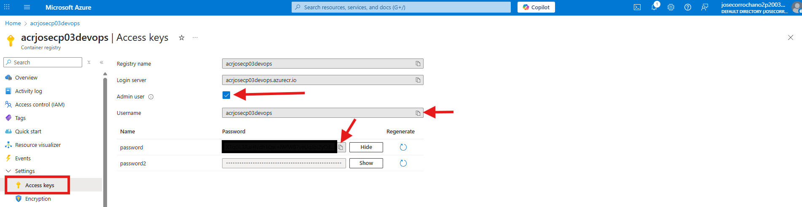
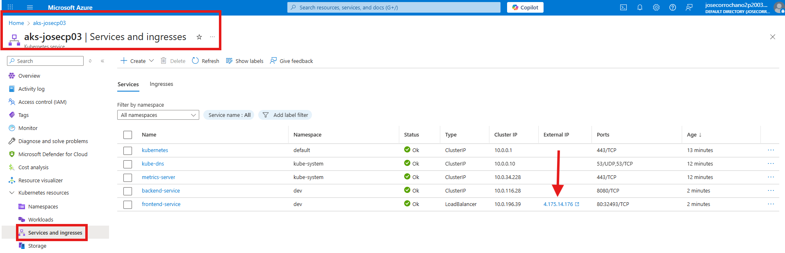
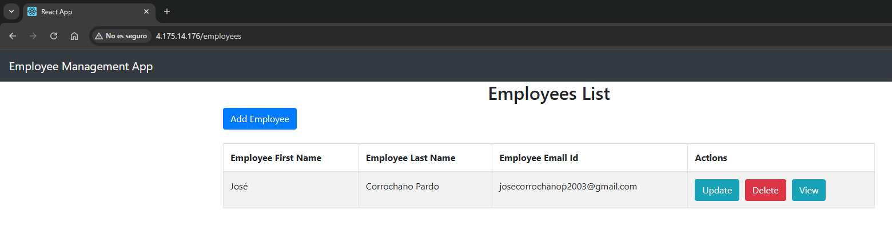

# ☸️ Paso 5 - Kubernetes

Kubernetes es una plataforma de orquestación de contenedores que permite desplegar, escalar y gestionar aplicaciones de manera automática en distintos entornos. En un proyecto DevOps como el que estoy desarrollando, me sirve para garantizar que los servicios se ejecuten de forma confiable, distribuidos y con alta disponibilidad, evitando así tener que administrar manualmente los contenedores. 

## 📋 Tabla de contenidos

- [☸️ Paso 5 - Kubernetes](#️-paso-5---kubernetes)
  - [📋 Tabla de contenidos](#-tabla-de-contenidos)
  - [💻 5.1 Instalaciones](#-51-instalaciones)
  - [📂 5.3 Estructura de archivos](#-53-estructura-de-archivos)
  - [🗂️ 5.4 Archivos kubernetes](#️-54-archivos-kubernetes)
    - [🖥️ backend](#️-backend)
      - [`dev/backend/configmap.yml`](#devbackendconfigmapyml)
      - [`dev/backend/secrets.yml`](#devbackendsecretsyml)
      - [`dev/backend/deployment.yml`](#devbackenddeploymentyml)
      - [`dev/backend/service.yml`](#devbackendserviceyml)
    - [🎨 frontend](#-frontend)
      - [`dev/frontend/deployment.yml`](#devfrontenddeploymentyml)
      - [`dev/frontend/service.yml`](#devfrontendserviceyml)
  - [⚙️ 5.5 Configuraciones previas al despliegue](#️-55-configuraciones-previas-al-despliegue)
  - [🚀 5.6 Despliegue de los pods](#-56-despliegue-de-los-pods)

---

## 💻 5.1 Instalaciones

Para poder realizar pruebas previas antes de desplegar en un entorno productivo como Azure Kubernetes Service (AKS), es recomendable utilizar Minikube, una herramienta que permite crear un clúster de Kubernetes de forma local sobre Docker Desktop. Para poder trabajar con Kubernetes, en primer lugar será necesario instalar kubectl, que es la utilidad de línea de comandos oficial para interactuar con el clúster, y posteriormente Minikube, que nos permitirá levantar un clúster en nuestro propio entorno. Una vez completada la instalación, iniciaremos el clúster y verificaremos que se encuentra en funcionamiento. A continuación, se detallan los pasos de instalación y configuración necesarios para poner todo esto en marcha.

* Lo primero que hacemos es actualizar el índice de paquetes:

    ```bash
    sudo apt-get update
    ```

* Descargamos el binario más reciente de kubectl:

    ```bash
    curl -LO "https://dl.k8s.io/release/$(curl -L -s https://dl.k8s.io/release/stable.txt)/bin/linux/amd64/kubectl"
    ```

* Damos permisos de ejecución al binario:

    ```bash
    chmod +x kubectl
    ```

* Movemos kubectl a una ruta global del sistema:

    ```bash
    sudo mv kubectl /usr/local/bin/
    ```

* Comprobamos que se ha instalado correctamente:

    ```bash
    kubectl version --client
    ```

[🔝 Volver a la tabla de contenidos 🔝](#-tabla-de-contenidos) 

---

## 📂 5.3 Estructura de archivos

Esta estructura de archivos organiza los recursos de Kubernetes para el proyecto en dos secciones principales: **backend** y **frontend**. Cada sección contiene los archivos necesarios para desplegar la aplicación, incluyendo `ConfigMap` y `Secret` para configuración y credenciales, `Deployment` para definir los contenedores y su escalado, y `Service` para exponer la aplicación dentro o fuera del cluster según corresponda.

```
kubernetes/
└── dev/
    ├── backend/
    │   ├── configmap.yml          ← Configuración de variables de entorno y parámetros
    │   ├── deployment.yml         ← Despliegue del backend
    │   ├── secrets.yml            ← Secretos 
    │   └── service.yml            ← Exposición del backend dentro del clúster
    └── frontend/
        ├── deployment.yml         ← Despliegue del frontend
        └── service.yml            ← Exposición del frontend 
```

---

## 🗂️ 5.4 Archivos kubernetes

### 🖥️ backend

#### `dev/backend/configmap.yml`

```yml
apiVersion: v1
kind: ConfigMap
metadata:
  name: mi-app-config
  namespace: dev
data:
  SPRING_DATASOURCE_URL: "jdbc:mysql://10.0.2.5:3306/employee_management_system?useSSL=false"
  SPRING_DATASOURCE_USERNAME: "employee_app_user"
```

---

#### `dev/backend/secrets.yml`

```yml
apiVersion: v1
kind: Secret
metadata:
  name: mi-app-secrets
  namespace: dev
type: Opaque
data:
  SPRING_DATASOURCE_PASSWORD: TXlTM2N1cjNQQHNzdzByZCE=
```
> La contraseña de la base de datos se almacena codificada en Base64 para mayor seguridad. Más adelante se explicará cómo generar esta codificación y utilizarla correctamente en Kubernetes.

---

#### `dev/backend/deployment.yml`

```yml
apiVersion: apps/v1
kind: Deployment
metadata:
  name: backend
  namespace: dev
spec:
  replicas: 2
  selector:
    matchLabels:
      app: backend
  template:
    metadata:
      labels:
        app: backend
    spec:
      imagePullSecrets:
        - name: acr-secret
      containers:
        - name: backend
          image: acrjosecp03devops.azurecr.io/backend:latest
          ports:
            - containerPort: 8080
          envFrom:
            - configMapRef:
                name: mi-app-config
            - secretRef:
                name: mi-app-secrets
```

---

#### `dev/backend/service.yml`

```yml
apiVersion: v1
kind: Service
metadata:
  name: backend-service
  namespace: dev
spec:
  selector:
    app: backend
  ports:
    - protocol: TCP
      port: 8080
      targetPort: 8080
  type: ClusterIP
```

[🔝 Volver a la tabla de contenidos 🔝](#-tabla-de-contenidos) 

---

### 🎨 frontend

#### `dev/frontend/deployment.yml`

```yml
apiVersion: apps/v1
kind: Deployment
metadata:
  name: frontend
  namespace: dev
spec:
  replicas: 2
  selector:
    matchLabels:
      app: frontend
  template:
    metadata:
      labels:
        app: frontend
    spec:
      imagePullSecrets:
        - name: acr-secret
      containers:
        - name: frontend
          image: acrjosecp03devops.azurecr.io/frontend:latest
          ports:
            - containerPort: 80
```

---

#### `dev/frontend/service.yml`

```yml
apiVersion: v1
kind: Service
metadata:
  name: frontend-service
  namespace: dev
spec:
  selector:
    app: frontend
  ports:
    - protocol: TCP
      port: 80
      targetPort: 80
  type: LoadBalancer
```

---

## ⚙️ 5.5 Configuraciones previas al despliegue

Antes de desplegar aplicaciones en Kubernetes, es fundamental preparar el entorno y configurar ciertos elementos. Esto incluye crear namespaces, manejar secretos para acceder a registros privados de contenedores y asegurarse de que nuestro cliente de Kubernetes esté conectado al clúster correcto. Estos pasos previos garantizan que el despliegue sea seguro, organizado y que la comunicación con servicios externos funcione correctamente.

1. Lo primero es **conocer la clave de nuestro Azure Container Registry (ACR)**, porque la necesitamos para crear los secretos en Kubernetes y que el clúster pueda descargar las imágenes privadas correctamente antes de desplegar las aplicaciones. Esta clave la obtenemos como se ve en la siguiente captura de pantalla:

  

  Una vez que tenemos la clave, la codificamos en Base64 con el siguinete comando: 

  ```bash
  echo -n 'valorRealDeLaClave' | base64
  ```

  El valor resultante es el que debemos poner en el `secret.yml` para que Kubernetes pueda usarlo.

2. Configurar kubectl con las credenciales del clúster AKS especificado, permitiendo que los comandos apunten al clúster correcto en Azure.

  ```bash
  az aks get-credentials --resource-group rg-proyecto-devops --name aks-josecp03
  ```

3. Crear un namespace llamado dev para organizar los recursos del clúster y evitar conflictos entre entornos.

  ```bash
  kubectl create namespace dev
  ```

3. Crear un secreto Docker Registry llamado acr-secret en el namespace dev para que Kubernetes pueda autenticarse y descargar imágenes privadas del ACR.

  ```bash
  kubectl create secret docker-registry acr-secret --docker-server=acrjosecp03devops.azurecr.io --docker-username=acrjosecp03devops --docker-password=X1qG... --docker-email=josecorrochanop2003@gmail.com -n dev
  ```

[🔝 Volver a la tabla de contenidos 🔝](#-tabla-de-contenidos) 

---

## 🚀 5.6 Despliegue de los pods

Una vez que tenemos el entorno configurado con el namespace y los secretos, es hora de desplegar nuestras aplicaciones en Kubernetes. Esto implica aplicar los manifiestos que definen los pods y verificar que se estén ejecutando correctamente.

* Aplicamos todos los archivos de configuración YAML en el directorio actual y sus subdirectorios en el namespace dev, desplegando los pods y recursos necesarios.

  ```bash
  kubectl apply -f . -n dev --recursive
  ```

* Mostramos el estado de todos los pods en el namespace dev, permitiendo verificar que se estén ejecutando correctamente.

  ```bash
  kubectl get pods -n dev
  ```

* Para acceder a la página basta con irnos a la siguinete sección y acceder a la página mediante la ip generada:

  

* Y vemos como todo funciona perfectamente:

  

[🔝 Volver a la tabla de contenidos 🔝](#-tabla-de-contenidos) 


