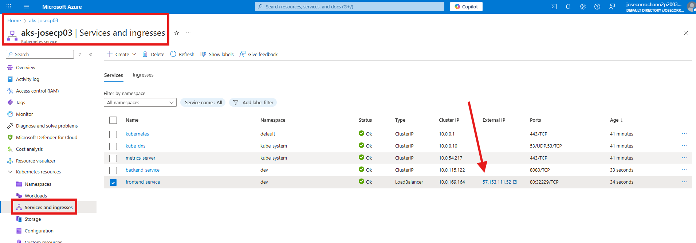
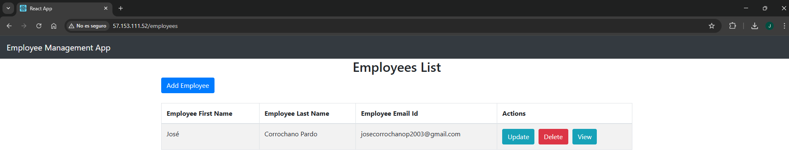

# ⚓ Paso 6 - Helm

Ya hemos desplegado nuestra aplicación directamente con Kubernetes, creando manualmente todos los manifiestos YAML. Sin embargo, a medida que la aplicación crece y necesitamos distintos entornos (dev, prod, etc.), gestionar todos estos ficheros se vuelve complejo. Para simplificar esto, usamos Helm, un gestor de paquetes para Kubernetes que permite empaquetar, versionar y desplegar aplicaciones mediante charts. Un chart organiza los manifiestos con variables y plantillas, lo que facilita la reutilización, la actualización de versiones y la consistencia entre entornos. En resumen, primero usamos Kubernetes para entender el despliegue básico, y ahora Helm nos ayuda a automatizar y mantener nuestro flujo de despliegue de manera más eficiente.

---

## 📋 Tabla de contenidos

- [⚓ Paso 6 - Helm](#-paso-6---helm)
  - [📋 Tabla de contenidos](#-tabla-de-contenidos)
  - [💻 6.1 Instalación](#-61-instalación)
  - [📂 6.2 Estructura de archivos](#-62-estructura-de-archivos)
  - [🗂️ 6.3 Archivos Helm](#️-63-archivos-helm)
    - [🚀 Archivos raíz](#-archivos-raíz)
      - [`Chart.yaml`](#chartyaml)
      - [`values.yaml`](#valuesyaml)
    - [🖥️ backend](#️-backend)
      - [`templates/backend/configmap.yml`](#templatesbackendconfigmapyml)
      - [`templates/backend/secrets.yml`](#templatesbackendsecretsyml)
      - [`templates/backend/deployment.yml`](#templatesbackenddeploymentyml)
      - [`templates/backend/service.yml`](#templatesbackendserviceyml)
    - [🎨 frontend](#-frontend)
      - [`templates/frontend/deployment.yml`](#templatesfrontenddeploymentyml)
      - [`templates/frontend/service.yml`](#templatesfrontendserviceyml)
  - [🚀 6.5 Despliegue con Helm](#-65-despliegue-con-helm)
  - [✅ 6.6 Comprobación del funcionamiento](#-66-comprobación-del-funcionamiento)

---

## 💻 6.1 Instalación

En Ubuntu o distribuciones basadas en Debian, la instalación de Helm se realiza con los siguientes pasos:

1. **Actualizar el índice de paquetes del sistema:**

   ```bash
   sudo apt-get update
   ```

2. **Descargar el script oficial de instalación de Helm:**

   ```bash
   curl https://raw.githubusercontent.com/helm/helm/main/scripts/get-helm-3 | bash
   ```

   > Este script descarga automáticamente la última versión estable de Helm y la instala en `/usr/local/bin/helm`.

3. **Verificar la instalación:**

   ```bash
   helm version
   ```

   Resultado esperado:

   ```
   version.BuildInfo{Version:"v3.14.0", GitCommit:"...", ...}
   ```

---

## 📂 6.2 Estructura de archivos

La estructura de Helm quedaría organizada así:

```
helm/
└── mi-app/
    ├── Chart.yaml                  ← Metadatos del chart (nombre, versión, etc.)
    ├── values-dev.yml             ← Valores específicos para entorno dev
    └── templates/                  ← Plantillas que Helm renderiza a YAML
        ├── backend/                ← Recursos del backend
        │   ├── configmap.yml      ← Variables de configuración 
        │   ├── secrets.yml        ← Variables sensibles 
        │   ├── deployment.yml     ← Despliegue del backend 
        │   └── service.yml        ← Service para exponer el backend
        └── frontend/               ← Recursos del frontend
            ├── deployment.yml     ← Despliegue del frontend 
            └── service.yml        ← Service para exponer el frontend
```

---

## 🗂️ 6.3 Archivos Helm

### 🚀 Archivos raíz

#### `Chart.yaml` 

```yaml
apiVersion: v2
name: mi-app
description: Chart para desplegar backend y frontend
version: 0.1.0
appVersion: "1.0"
```

---

#### `values.yaml` 

```yaml
namespace: dev

backend:
  replicaCount: 2
  image:
    repository: acrjosecp03devops.azurecr.io/backend
    tag: latest
  service:
    port: 8080

frontend:
  replicaCount: 2
  image:
    repository: acrjosecp03devops.azurecr.io/frontend
    tag: latest
  service:
    port: 80

config:
  SPRING_DATASOURCE_URL: "jdbc:mysql://10.0.2.5:3306/employee_management_system?useSSL=false"
  SPRING_DATASOURCE_USERNAME: "employee_app_user"
  SPRING_DATASOURCE_PASSWORD: "TXlTM2N1cjNQQHNzdzByZCE=" 
```

---


### 🖥️ backend

#### `templates/backend/configmap.yml`

```yaml
apiVersion: v1
kind: ConfigMap
metadata:
  name: mi-app-config
  namespace: {{ .Values.namespace }}
data:
  SPRING_DATASOURCE_URL: {{ .Values.config.SPRING_DATASOURCE_URL | quote }}
  SPRING_DATASOURCE_USERNAME: {{ .Values.config.SPRING_DATASOURCE_USERNAME | quote }}
```

#### `templates/backend/secrets.yml`

```yaml
apiVersion: v1
kind: Secret
metadata:
  name: mi-app-secrets
  namespace: {{ .Values.namespace }}
type: Opaque
data:
  SPRING_DATASOURCE_PASSWORD: {{ .Values.config.SPRING_DATASOURCE_PASSWORD | quote }}
```

#### `templates/backend/deployment.yml`

```yaml
apiVersion: apps/v1
kind: Deployment
metadata:
  name: backend
  namespace: {{ .Values.namespace }}
spec:
  replicas: {{ .Values.backend.replicaCount }}
  selector:
    matchLabels:
      app: backend
  template:
    metadata:
      labels:
        app: backend
    spec:
      imagePullSecrets:
        - name: acr-secret
      containers:
        - name: backend
          image: "{{ .Values.backend.image.repository }}:{{ .Values.backend.image.tag }}"
          ports:
            - containerPort: {{ .Values.backend.service.port }}
          envFrom:
            - configMapRef:
                name: mi-app-config
            - secretRef:
                name: mi-app-secrets
```

#### `templates/backend/service.yml`

```yaml
apiVersion: v1
kind: Service
metadata:
  name: backend-service
  namespace: {{ .Values.namespace }}
spec:
  selector:
    app: backend
  ports:
    - protocol: TCP
      port: {{ .Values.backend.service.port }}
      targetPort: {{ .Values.backend.service.port }}
  type: ClusterIP
```

---

### 🎨 frontend

#### `templates/frontend/deployment.yml`

```yaml
apiVersion: apps/v1
kind: Deployment
metadata:
  name: frontend
  namespace: {{ .Values.namespace }}
spec:
  replicas: {{ .Values.frontend.replicaCount }}
  selector:
    matchLabels:
      app: frontend
  template:
    metadata:
      labels:
        app: frontend
    spec:
      imagePullSecrets:
        - name: acr-secret
      containers:
        - name: frontend
          image: "{{ .Values.frontend.image.repository }}:{{ .Values.frontend.image.tag }}"
          ports:
            - containerPort: {{ .Values.frontend.service.port }}
```

#### `templates/frontend/service.yml`

```yaml
apiVersion: v1
kind: Service
metadata:
  name: frontend-service
  namespace: {{ .Values.namespace }}
spec:
  selector:
    app: frontend
  ports:
    - protocol: TCP
      port: {{ .Values.frontend.service.port }}
      targetPort: {{ .Values.frontend.service.port }}
  type: LoadBalancer
```

---

## 🚀 6.5 Despliegue con Helm

1. **Instalar el chart en el namespace `dev`:**

   ```bash
   helm install mi-app . -f values.yaml -n dev
   ```

2. **Verificar los pods desplegados:**

   ```bash
   kubectl get pods -n dev
   ```

3. **Desinstalar la aplicación:**

   ```bash
   helm uninstall mi-app -n dev
   ```

---

## ✅ 6.6 Comprobación del funcionamiento

* Para probar que funciona nuestra aplicación desplegada con helm basta con irnos al portal de azure y pinchar en el siguiente enlace:

  

* Y vemos como funciona la página web sin ningún problema

  


