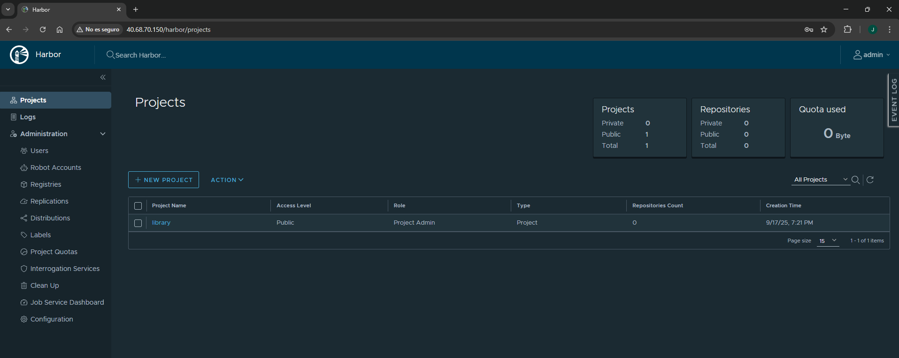
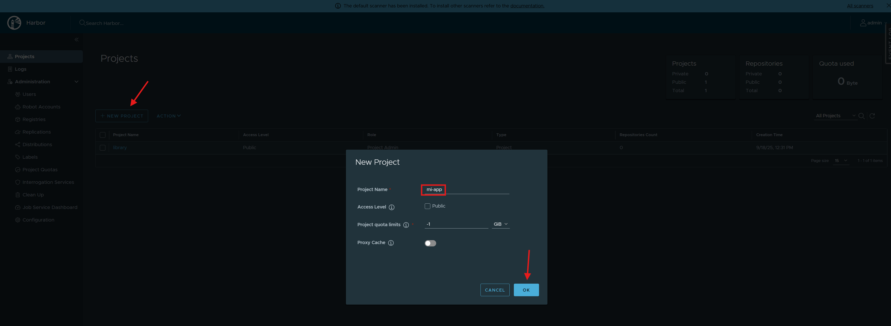
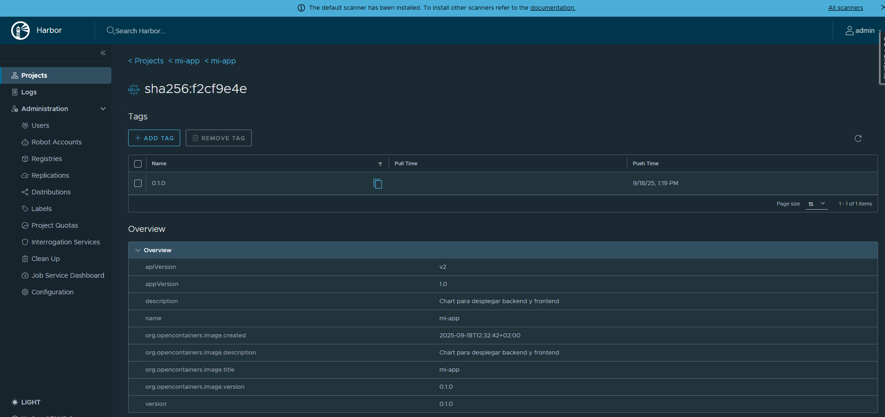
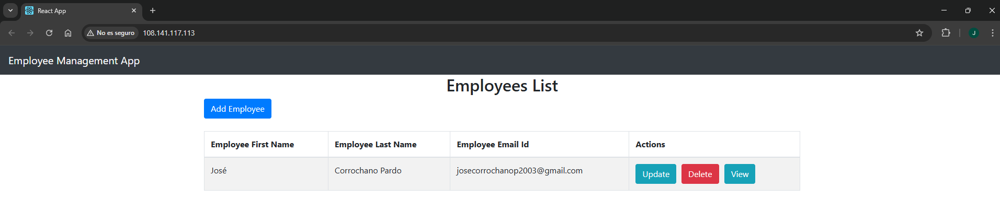

# 🛠️ Paso 7 - Despliegue de Harbor

Harbor es un **registro de contenedores** que permite almacenar, firmar y escanear imágenes Docker de forma segura. En un proyecto DevOps, Harbor se utiliza para centralizar imágenes y charts de Helm, garantizar seguridad y control de acceso, y facilitar la distribución de contenedores entre entornos de desarrollo, prueba y producción. En este caso, lo usaremos simplemente para almacenar nuestros charts de Helm; aunque no es estrictamente necesario para este proyecto, se hace como buena práctica, ya que permite que todo el equipo pueda descargarlos de manera sencilla y centralizada, asegurando que todos trabajen con las mismas versiones y evitando problemas de compatibilidad o duplicación.

## 📋 Tabla de contenidos

- [🛠️ Paso 7 - Despliegue de Harbor](#️-paso-7---despliegue-de-harbor)
  - [📋 Tabla de contenidos](#-tabla-de-contenidos)
  - [⚙️ 7.1 Preparación del entorno](#️-71-preparación-del-entorno)
  - [📂 7.2 Estructura de archivos](#-72-estructura-de-archivos)
  - [🗂️ 7.3 Archivos](#️-73-archivos)
    - [`values.yaml`](#valuesyaml)
    - [`update-harbor-domain.sh`](#update-harbor-domainsh)
  - [🚀 7.4 Instalación y despliegue de Harbor](#-74-instalación-y-despliegue-de-harbor)
  - [🔍 7.5 Verificación del despliegue](#-75-verificación-del-despliegue)
  - [⚙️ 7.6 Empaquetado y subida a Harbor](#️-76-empaquetado-y-subida-a-harbor)
  - [7.7 ✅ Comprobación](#77--comprobación)

---

## ⚙️ 7.1 Preparación del entorno

Antes de desplegar Harbor, es recomendable preparar Kubernetes:

1. Crear un **namespace específico** para Harbor, separando los recursos de tus aplicaciones:

  ```bash
  kubectl create namespace harbor
  ```

2. Añadir el **repositorio oficial de charts de Harbor**:

  ```bash
  helm repo add harbor https://helm.goharbor.io
  helm repo update
  ```

> Esto asegura que disponemos de la última versión de los charts oficiales para instalar Harbor.

---

## 📂 7.2 Estructura de archivos

Para mantener ordenada la configuración, crearemos la siguiente estructura de carpetas:

```
harbor/
├── values.yaml                   ← Configuración de Harbor
└── update-harbor-domain.sh       ← Script para configurar Harbor
```

---

## 🗂️ 7.3 Archivos

### `values.yaml`

Este archivo sirve para configurar cómo se instala y funciona Harbor, definiendo la URL de acceso, seguridad, contraseñas y dónde se guardan los datos de forma persistente.

```yaml
expose:
  type: loadBalancer
  tls:
    enabled: true
    certSource: auto
    auto:
      commonName: placeholder.domain

externalURL: https://placeholder.domain

harborAdminPassword: "Harbor12345"

persistence:
  enabled: true
  resourcePolicy: "keep"
  persistentVolumeClaim:
    registry:
      storageClass: ""
      accessMode: ReadWriteOnce
      size: 20Gi
    jobservice:
      jobLog:
        storageClass: ""
        accessMode: ReadWriteOnce
        size: 1Gi
    database:
      storageClass: ""
      accessMode: ReadWriteOnce
      size: 5Gi
    redis:
      storageClass: ""
      accessMode: ReadWriteOnce
      size: 2Gi
    trivy:
      storageClass: ""
      accessMode: ReadWriteOnce
      size: 5Gi
  imageChartStorage:
    type: filesystem
    filesystem:
      rootdirectory: /storage
```

[🔝 Volver a la tabla de contenidos 🔝](#-tabla-de-contenidos) 

---

### `update-harbor-domain.sh`

Este script automatiza la actualización de Harbor, obteniendo su dirección de acceso, configurando seguridad, esperando a que esté listo y realizando el login, de manera que puedas usarlo inmediatamente sin tener que hacer pasos manuales.

```bash
#!/bin/bash

# 1. Obtener la IP del LoadBalancer
HARBOR_IP=$(kubectl get svc -n harbor harbor -o jsonpath='{.status.loadBalancer.ingress[0].ip}')
if [ -z "$HARBOR_IP" ]; then
  echo "Error: no se ha detectado la IP del LoadBalancer"
  exit 1
fi

# 2. Exportar la variable para que esté disponible fuera del script
export HARBOR_IP

# 3. Actualizar Harbor con helm upgrade (externalURL + TLS commonName)
helm upgrade my-harbor harbor/harbor -n harbor -f values.yaml \
  --set externalURL=https://$HARBOR_IP \
  --set expose.tls.auto.commonName=$HARBOR_IP

# 4. Esperar a que los pods estén listos
echo "Esperando a que los pods de Harbor estén listos..."
kubectl wait --for=condition=Ready pods -l app.kubernetes.io/component=core -n harbor --timeout=300s
kubectl wait --for=condition=Ready pods -l app.kubernetes.io/component=database -n harbor --timeout=300s

# 5. Extraer la cadena completa de certificados TLS de Harbor
echo "Extrayendo la cadena completa de certificados TLS de Harbor..."
echo | openssl s_client -showcerts -servername $HARBOR_IP -connect $HARBOR_IP:443 2>/dev/null \
  | sed -ne '/-BEGIN CERTIFICATE-/,/-END CERTIFICATE-/p' > harbor-ca.crt

# 6. Instalar certificado en el sistema
echo "Instalando certificado en el sistema..."
sudo mkdir -p /usr/local/share/ca-certificates/harbor
sudo cp harbor-ca.crt /usr/local/share/ca-certificates/harbor/
sudo update-ca-certificates

# 7. Login en Helm registry usando certificado local
export SSL_CERT_FILE=$(pwd)/harbor-ca.crt
echo "Harbor12345" | helm registry login $HARBOR_IP --username admin --password-stdin

# 8. Eliminar certificado temporal
rm -f harbor-ca.crt

# 9. Mensaje final
echo "Actualización completada. Ahora puedes usar https://$HARBOR_IP"
```

---

## 🚀 7.4 Instalación y despliegue de Harbor

Para desplegar Harbor con Helm:

* Instalamos Harbor en el namespace `harbor` usando la configuración de `values.yaml`:

  ```bash
  helm install my-harbor harbor/harbor -n harbor -f values.yaml
  ```

* Damos los permisos necesarios a nuestro script creado anteriormente:

  ```bash
  chmod +x update-harbor-domain.sh
  ```

* Ejecutamos el script usando *source* para exportar de forma correcta la variable que contiene nuestra IP de Harbor que usaremos más adelante:

  ```bash
  source ./update-harbor-domain.sh
  ```

---

## 🔍 7.5 Verificación del despliegue

1. Comprobar el estado de los pods:

  ```bash
  kubectl get pods -n harbor
  ```

2. Accedemos a harbor a través del portal de Azure:

  

3. Usando **user = admin** y **password=Harbor12345** (O la que hayas configurado) ya podemos entrar sin problema:
   
   

[🔝 Volver a la tabla de contenidos 🔝](#-tabla-de-contenidos) 

---

## ⚙️ 7.6 Empaquetado y subida a Harbor

En este apartado se explica cómo empaquetar una aplicación en un chart de Helm y subirla a Harbor, creando así un repositorio centralizado de tus aplicaciones. Esto permite gestionar versiones de manera ordenada, compartir los charts entre distintos entornos o equipos, y facilitar la instalación y actualización de tus aplicaciones de forma reproducible y segura sin tener que configurar todo manualmente cada vez.

Realizamos los siguientes pasos para ello (Desde la raíz de la carpeta de todo nuestro proyecto):

1. **Crear el proyecto dentro de harbor:**

  

2. **Empaquetar el chart:**

  ```bash
  helm package ./helm/mi-app
  ```

  > Esto genera un archivo `.tgz`, por ejemplo: `mi-app-0.1.0.tgz`.

3. **Subir el chart a Harbor**
  ```bash
  helm push mi-app-0.1.0.tgz oci://$HARBOR_IP/mi-app
  ```

1. **Comprobar que el chart se ha subido**

  

---

## 7.7 ✅ Comprobación

En este apartado simulamos que somos un miembro del equipo que necesita desplegar la aplicación pero no tiene los charts disponibles localmente. Para ello, primero descargamos el chart desde Harbor usando `helm pull` y luego lo instalamos en nuestro entorno con `helm install`. Esto demuestra cómo, gracias a tener los charts centralizados en Harbor, cualquier persona del equipo puede desplegar la aplicación de manera rápida y consistente, sin necesidad de configurar o preparar manualmente los recursos, y comprobar que todo funciona correctamente desde el portal.

Los pasos son los siguientes (Desde la raíz de la carpeta de todo nuestro proyecto):

* Descargarnos la imagen de Harbor:

  ```bash
  helm pull oci://$HARBOR_IP/mi-app/mi-app --version 0.1.0
  ```
  
* Instalar el chart con el paquete recién descragado:
  
  ```bash
  helm install mi-app-release mi-app-0.1.0.tgz -n dev
  ```

* Y vemos como podemos acceder a la página con total normalidad desde el portal de Azure:

  

[🔝 Volver a la tabla de contenidos 🔝](#-tabla-de-contenidos) 


