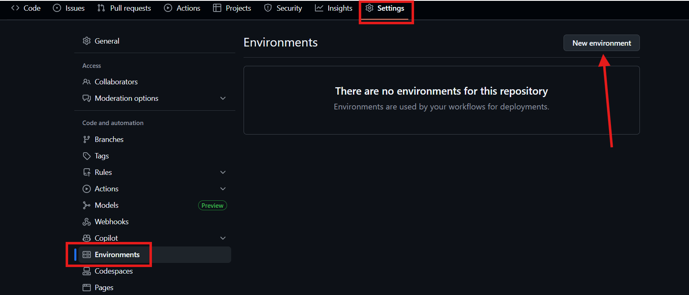
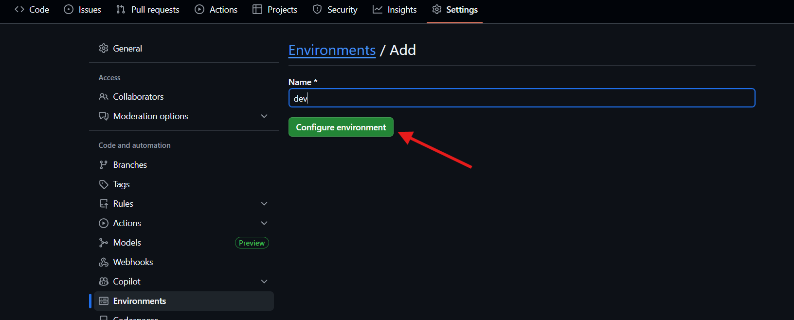
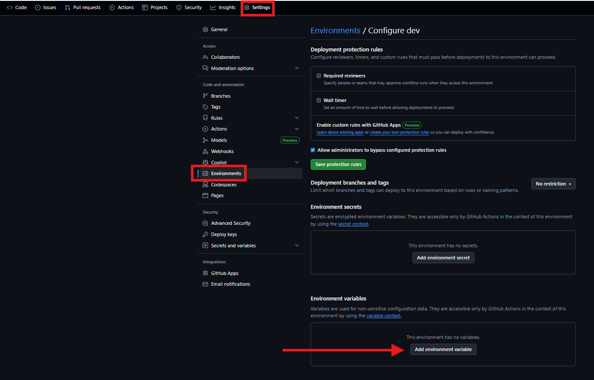
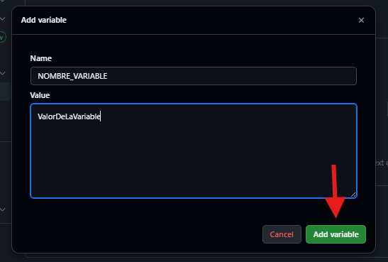
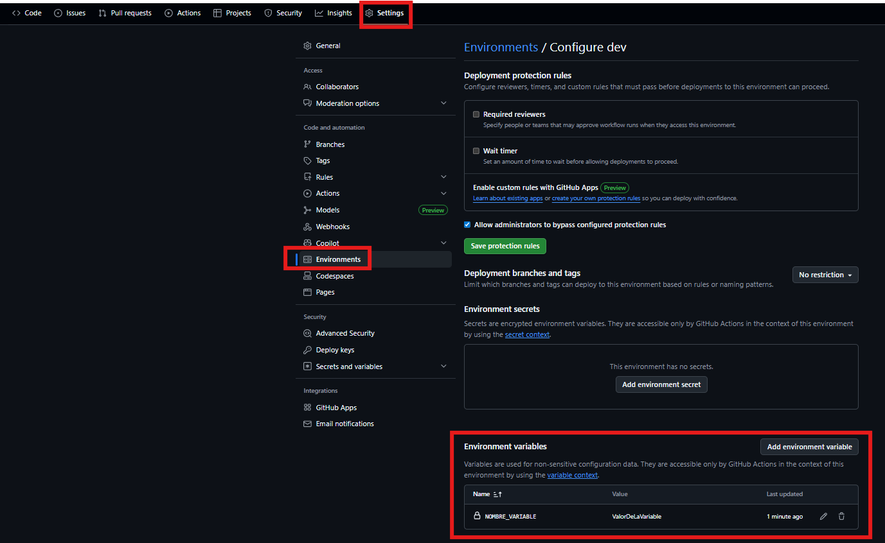
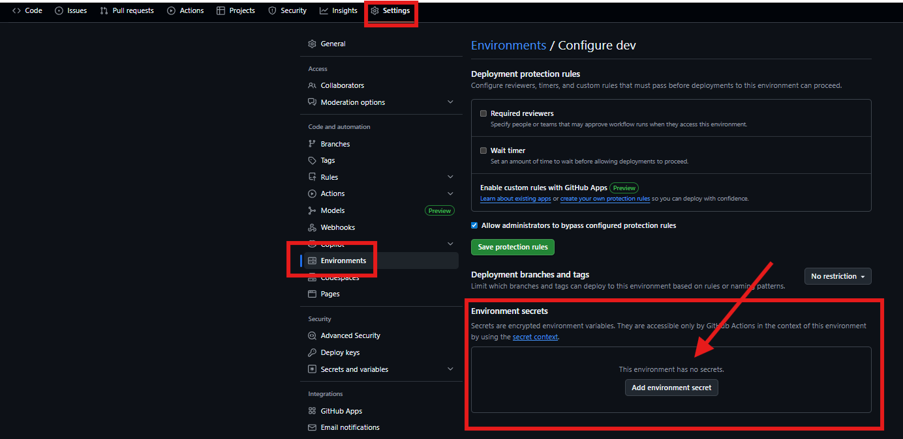

# 🔄 8. Pipelines de CI/CD con GitHub Actions

En este apartado se definen y configuran los pipelines de CI/CD que automatizan el ciclo de vida de la aplicación utilizando GitHub Actions. Un pipeline de CI/CD es la secuencia de pasos automatizados que permiten, por un lado, la integración continua (CI), donde cada cambio en el código se construye, valida y prueba automáticamente, y por otro, la entrega y despliegue continuo (CD), donde las nuevas versiones se publican y se despliegan de forma ágil y controlada en los entornos correspondientes. En este proyecto, GitHub Actions actúa como el motor de orquestación que, al detectar cambios en los distintos repositorios de frontend, backend e infraestructura, ejecuta los flujos necesarios para construir y versionar imágenes Docker, publicarlas en el registro de contenedores, aplicar cambios de infraestructura con Terraform, ejecutar playbooks de Ansible o desplegar actualizaciones mediante Helm en Kubernetes. De esta manera se garantiza un proceso repetible, seguro y automatizado que reduce errores manuales y acelera la entrega de valor.

## 📋 Tabla de contenidos

- [🔄 8. Pipelines de CI/CD con GitHub Actions](#-8-pipelines-de-cicd-con-github-actions)
  - [📋 Tabla de contenidos](#-tabla-de-contenidos)
  - [🗺️ 8.1 Esquema Pipelines](#️-81-esquema-pipelines)
    - [📌 8.1.1 Infra Repo](#-811-infra-repo)
    - [🌐 8.1.2 Frontend Repo](#-812-frontend-repo)
    - [⚙️ 8.1.3 Backend Repo](#️-813-backend-repo)
    - [🗄️ Repositorios de Imágenes y Despliegue](#️-repositorios-de-imágenes-y-despliegue)
  - [🔑 8.2 Configuración de entornos](#-82-configuración-de-entornos)
  - [📦 8.2 Frontend \& Backend Repositories](#-82-frontend--backend-repositories)
  - [8.3](#83)

---

## 🗺️ 8.1 Esquema Pipelines

Para organizar mejor los diferentes flujos de trabajo de mi proyecto, he utilizado un **esquema visual** que representa cómo se estructuran los pipelines y los workflows, tanto a nivel de infraestructura como de despliegue de frontend y backend. Este diagrama me ayuda a tener una visión clara de cada etapa y cómo se interconectan entre sí.  

---

### 📌 8.1.1 Infra Repo

El repositorio de infraestructura incluye tres tipos de cambios principales:

- **Terraform cambios** → se validan con `terraform fmt + validate`, luego se ejecuta `terraform plan`, requiere aprobación manual, y finalmente se aplica con `terraform apply`.  
- **Ansible cambios** → tras detectar cambios, se lanza un *Playbook* sobre las máquinas virtuales correspondientes.  
- **Helm cambios** → se empaqueta el *chart Helm* y se publica en el repositorio de charts **Harbor**.  

---

### 🌐 8.1.2 Frontend Repo

En el repositorio de frontend: 

- Al hacer **push de cambios**, se construye la **imagen Docker** del frontend.  
- La imagen se etiqueta con `latest` y la versión correspondiente.  
- Finalmente, la imagen se sube a **Azure Container Registry (ACR)**.  

---

### ⚙️ 8.1.3 Backend Repo

En el repositorio de backend:  

- Al hacer **push de cambios**, se construye la **imagen Docker** del backend.  
- La imagen se etiqueta con `latest` y la versión correspondiente.  
- Igual que en el frontend, se sube a **Azure Container Registry (ACR)**.  

---

### 🗄️ Repositorios de Imágenes y Despliegue

- El **Harbor Helm Repo** almacena los *charts Helm* empaquetados desde el repo de infraestructura.  
- El **Azure Container Registry (ACR)** almacena las imágenes Docker del frontend y backend.  
- Desde Harbor se realiza el despliegue con `helm upgrade --install`, tomando las últimas versiones de imágenes y charts.  

[🔝 Volver a la tabla de contenidos 🔝](#-tabla-de-contenidos) 

---

## 🔑 8.2 Configuración de entornos

En esta sección voy a explicar cómo configurar los entornos en GitHub y la correcta gestión de secretos asociados a cada uno de ellos. La separación de entornos (por ejemplo, dev, pre y prod) es fundamental para garantizar un flujo de despliegue seguro y controlado, evitando exponer credenciales sensibles o reutilizar configuraciones en fases inadecuadas. Empezaremos creando el entorno dev, donde mostraremos cómo definir y almacenar variables sensibles necesarias para la ejecución de los workflows, y veremos cómo utilizarlas posteriormente dentro de la automatización del despliegue. De esta forma, sentamos las bases para un pipeline escalable y seguro que se adapte a las diferentes etapas del proyecto.

* Para crear el entorno tendremos que irnos dentro de los ajustes de nuestro repositorio a la siguiente sección:

  

* Una vez dentro, le ponemos el nombre que queramos y lo creamos:

  

En cada entorno de GitHub podemos crear secretos (datos sensibles como claves o contraseñas) y variables (valores no sensibles como nombres o rutas). Los secretos protegen la seguridad, mientras que las variables facilitan la configuración. A continuación, veremos cómo crear esto.

* Para crear una variable basta con irnos al siguinete apartado:
  
  

* Una vez dentro, creamos ponemos un nombre y un valor a nuestra variable:

  

* Y ya vemos como aparece nuestra variable en nuestro entorno, confirmando que se creó correctamente:

  

* Para crear un secerto es exactamente el mismo método pero en esta sección:

  

[🔝 Volver a la tabla de contenidos 🔝](#-tabla-de-contenidos) 

---

## 📦 8.2 Frontend & Backend Repositories

En este apartado se describen los repositorios dedicados al **frontend** y al **backend** de la aplicación.  
Aquí se detallan algunos de los **secretos y variables** que han sido necesarios para la correcta ejecución de los workflows de despliegue en **Azure Container Registry (ACR)**.  

🔗 Puedes consultar directamente el repositorio correspondiente en el siguiente enlace:  
[👉 Repositorio del Backend](https://github.com/Josecp03/BackEnd-DevOps-App)  
[👉 Repositorio del Frontend](https://github.com/Josecp03/FrontEnd-DevOps-App)

* La **variable** utilizada en ambos repositorios es la siguiente:
  
  ```bash
  REGISTRY = acrjosecp03devops.azurecr.io
  ```

* Y los **secretos** utilizados son estos:

  ```bash
  AZURE_ACR_NAME = acrjosecp03devops
  AZURE_ACR_PASSWORD = X1qG...
  ```

[🔝 Volver a la tabla de contenidos 🔝](#-tabla-de-contenidos) 

---

## 8.3 


