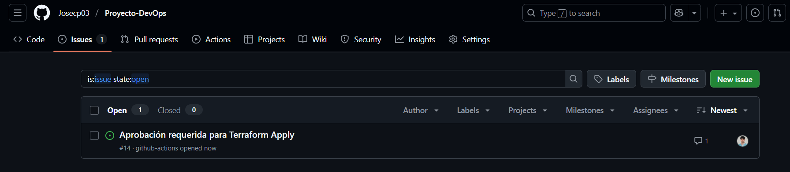
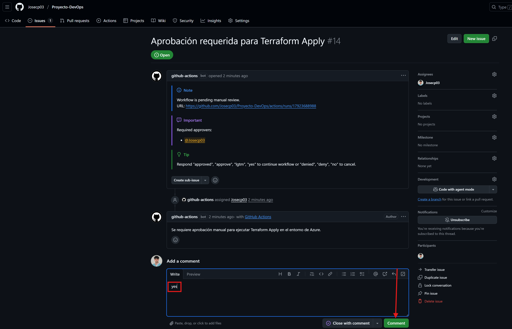
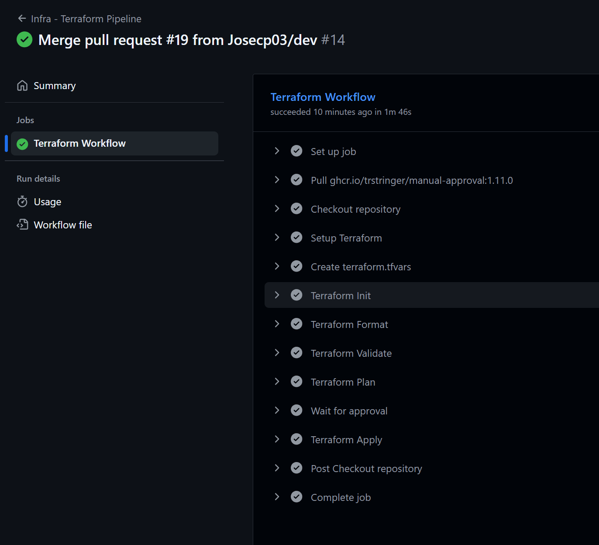

# 🔄 8. Pipelines de CI/CD con GitHub Actions

En este apartado se definen y configuran los pipelines de CI/CD que automatizan el ciclo de vida de la aplicación utilizando GitHub Actions. Un pipeline de CI/CD es la secuencia de pasos automatizados que permiten, por un lado, la integración continua (CI), donde cada cambio en el código se construye, valida y prueba automáticamente, y por otro, la entrega y despliegue continuo (CD), donde las nuevas versiones se publican y se despliegan de forma ágil y controlada en los entornos correspondientes. En este proyecto, GitHub Actions actúa como el motor de orquestación que, al detectar cambios en los distintos repositorios de frontend, backend e infraestructura, ejecuta los flujos necesarios para construir y versionar imágenes Docker, publicarlas en el registro de contenedores, aplicar cambios de infraestructura con Terraform, ejecutar playbooks de Ansible o desplegar actualizaciones mediante Helm en Kubernetes. De esta manera se garantiza un proceso repetible, seguro y automatizado que reduce errores manuales y acelera la entrega de valor.

## 📋 Tabla de contenidos

- [🔄 8. Pipelines de CI/CD con GitHub Actions](#-8-pipelines-de-cicd-con-github-actions)
  - [📋 Tabla de contenidos](#-tabla-de-contenidos)
  - [🗺️ 8.1 Esquema Pipelines](#️-81-esquema-pipelines)
    - [📌 8.1.1 Infra Repo](#-811-infra-repo)
    - [🌐 8.1.2 Frontend Repo](#-812-frontend-repo)
    - [⚙️ 8.1.3 Backend Repo](#️-813-backend-repo)
    - [🗄️ Repositorios de Imágenes y Despliegue](#️-repositorios-de-imágenes-y-despliegue)
  - [🔑 8.2 Configuración de entornos](#-82-configuración-de-entornos)
  - [📦 8.2 Frontend \& Backend Repositories](#-82-frontend--backend-repositories)
  - [🧱 8.3 Automatización de Terraform](#-83-automatización-de-terraform)
    - [`terraform-infra.yaml`](#terraform-infrayaml)
    - [🔑 Secretos necesarios para el pipeline de Terraform](#-secretos-necesarios-para-el-pipeline-de-terraform)
    - [✅ Comprobación](#-comprobación)
  - [⚙️ 8.4 Automatización de Ansible](#️-84-automatización-de-ansible)

---

## 🗺️ 8.1 Esquema Pipelines

Para organizar mejor los diferentes flujos de trabajo de mi proyecto, he utilizado un **esquema visual** que representa cómo se estructuran los pipelines y los workflows, tanto a nivel de infraestructura como de despliegue de frontend y backend. Este diagrama me ayuda a tener una visión clara de cada etapa y cómo se interconectan entre sí.  

---

### 📌 8.1.1 Infra Repo

El repositorio de infraestructura incluye tres tipos de cambios principales:

- **Terraform cambios** → se validan con `terraform fmt + validate`, luego se ejecuta `terraform plan`, requiere aprobación manual, y finalmente se aplica con `terraform apply`.  
- **Ansible cambios** → tras detectar cambios, se lanza un *Playbook* sobre las máquinas virtuales correspondientes.  
- **Helm cambios** → se empaqueta el *chart Helm* y se publica en el repositorio de charts **Harbor**.  

---

### 🌐 8.1.2 Frontend Repo

En el repositorio de frontend: 

- Al hacer **push de cambios**, se construye la **imagen Docker** del frontend.  
- La imagen se etiqueta con `latest` y la versión correspondiente.  
- Finalmente, la imagen se sube a **Azure Container Registry (ACR)**.  

---

### ⚙️ 8.1.3 Backend Repo

En el repositorio de backend:  

- Al hacer **push de cambios**, se construye la **imagen Docker** del backend.  
- La imagen se etiqueta con `latest` y la versión correspondiente.  
- Igual que en el frontend, se sube a **Azure Container Registry (ACR)**.  

---

### 🗄️ Repositorios de Imágenes y Despliegue

- El **Harbor Helm Repo** almacena los *charts Helm* empaquetados desde el repo de infraestructura.  
- El **Azure Container Registry (ACR)** almacena las imágenes Docker del frontend y backend.  
- Desde Harbor se realiza el despliegue con `helm upgrade --install`, tomando las últimas versiones de imágenes y charts.  

[🔝 Volver a la tabla de contenidos 🔝](#-tabla-de-contenidos) 

---

## 🔑 8.2 Configuración de entornos

En esta sección voy a explicar cómo configurar los entornos en GitHub y la correcta gestión de secretos asociados a cada uno de ellos. La separación de entornos (por ejemplo, dev, pre y prod) es fundamental para garantizar un flujo de despliegue seguro y controlado, evitando exponer credenciales sensibles o reutilizar configuraciones en fases inadecuadas. Empezaremos creando el entorno dev, donde mostraremos cómo definir y almacenar variables sensibles necesarias para la ejecución de los workflows, y veremos cómo utilizarlas posteriormente dentro de la automatización del despliegue. De esta forma, sentamos las bases para un pipeline escalable y seguro que se adapte a las diferentes etapas del proyecto.

* Para crear el entorno tendremos que irnos dentro de los ajustes de nuestro repositorio a la siguiente sección:

  

* Una vez dentro, le ponemos el nombre que queramos y lo creamos:

  

En cada entorno de GitHub podemos crear secretos (datos sensibles como claves o contraseñas) y variables (valores no sensibles como nombres o rutas). Los secretos protegen la seguridad, mientras que las variables facilitan la configuración. A continuación, veremos cómo crear esto.

* Para crear una variable basta con irnos al siguinete apartado:
  
  

* Una vez dentro, creamos ponemos un nombre y un valor a nuestra variable:

  

* Y ya vemos como aparece nuestra variable en nuestro entorno, confirmando que se creó correctamente:

  

* Para crear un secerto es exactamente el mismo método pero en esta sección:

  

[🔝 Volver a la tabla de contenidos 🔝](#-tabla-de-contenidos) 

---

## 📦 8.2 Frontend & Backend Repositories

En este apartado se describen los repositorios dedicados al **frontend** y al **backend** de la aplicación.  
Aquí se detallan algunos de los **secretos y variables** que han sido necesarios para la correcta ejecución de los workflows de despliegue en **Azure Container Registry (ACR)**.  

🔗 Puedes consultar directamente el repositorio correspondiente en el siguiente enlace:  
[👉 Repositorio del Backend](https://github.com/Josecp03/BackEnd-DevOps-App)  
[👉 Repositorio del Frontend](https://github.com/Josecp03/FrontEnd-DevOps-App)

* La **variable** utilizada en ambos repositorios es la siguiente:
  
  ```bash
  REGISTRY = acrjosecp03devops.azurecr.io
  ```

* Y los **secretos** utilizados son estos:

  ```bash
  AZURE_ACR_NAME = acrjosecp03devops
  AZURE_ACR_PASSWORD = X1qG...
  ```

[🔝 Volver a la tabla de contenidos 🔝](#-tabla-de-contenidos) 

---

## 🧱 8.3 Automatización de Terraform

En este apartado se explica cómo se ha automatizado el uso de Terraform mediante un pipeline configurado en GitHub Actions. El objetivo es integrar la gestión de la infraestructura dentro del flujo de trabajo de desarrollo, de forma que al modificar los archivos de configuración (.tf o .tfvars) se ejecute automáticamente un proceso controlado. Dicho proceso incluye la inicialización, validación y planificación de los cambios, además de una fase de aprobación manual antes de aplicar la infraestructura en Azure, garantizando seguridad y control en los despliegues.

### `terraform-infra.yaml`

```bash
name: Infra - Terraform Pipeline

on:
  push:
    branches:
      - main
    paths:
      - 'iac/**.tf'
      - 'iac/**.tfvars'
      - 'iac/**/*.tf'
  
  workflow_dispatch:

permissions:
  contents: write 
  issues: write 

concurrency:
  group: terraform-infra
  cancel-in-progress: false

jobs:
  terraform:
    name: Terraform Workflow
    runs-on: ubuntu-latest
    environment: dev   

    env:
      ARM_CLIENT_ID: ${{ secrets.AZURE_CLIENT_ID }}
      ARM_CLIENT_SECRET: ${{ secrets.AZURE_CLIENT_SECRET }}
      ARM_SUBSCRIPTION_ID: ${{ secrets.AZURE_SUBSCRIPTION_ID }}
      ARM_TENANT_ID: ${{ secrets.AZURE_TENANT_ID }}
      TF_CLI_ARGS_plan: "-target=module.compute.azurerm_linux_virtual_machine.db -target=module.compute.azurerm_linux_virtual_machine.bkp -target=module.aks"
      TF_CLI_ARGS_apply: "-target=module.compute.azurerm_linux_virtual_machine.db -target=module.compute.azurerm_linux_virtual_machine.bkp -target=module.aks"

    defaults:
      run:
        working-directory: iac 
        
    steps:
      # 1. Checkout del repo
      - name: Checkout repository
        uses: actions/checkout@v4

      # 2. Configurar Terraform
      - name: Setup Terraform
        uses: hashicorp/setup-terraform@v3
        with:
          terraform_version: 1.6.6

      # 3. Crear archivo terraform.tfvars desde secret
      - name: Create terraform.tfvars
        run: |
          cat <<'EOF' > terraform.tfvars
          ${{ secrets.TF_VARS }}
          EOF

      # 4. Inicializar Terraform
      - name: Terraform Init
        run: terraform init

      # 5. Validar formato y sintaxis
      - name: Terraform Format
        run: terraform fmt -recursive

      - name: Terraform Validate
        run: terraform validate

      # 6. Plan de ejecución
      - name: Terraform Plan
        run: terraform plan -input=false -out=tfplan

      # 7. Requiere aprobación manual antes de aplicar
      - name: Wait for approval
        uses: trstringer/manual-approval@v1
        with:
          approvers: Josecp03
          minimum-approvals: 1
          issue-title: "Aprobación requerida para Terraform Apply"
          issue-body: "Se requiere aprobación manual para ejecutar Terraform Apply en el entorno de Azure."
          exclude-workflow-initiator-as-approver: false
          fail-on-denial: true
          secret: ${{ secrets.GITHUB_TOKEN }}

      # 8. Apply después de la aprobación
      - name: Terraform Apply
        run: terraform apply -input=false -auto-approve tfplan
```

---

### 🔑 Secretos necesarios para el pipeline de Terraform

Para la correcta ejecución de este workflow es necesario definir en **GitHub Secrets** varias credenciales y configuraciones sensibles. Estas permiten tanto la autenticación contra **Azure** como la gestión dinámica de variables de Terraform:

```bash
AZURE_CLIENT_ID        = ID de la aplicación registrada en Azure (Service Principal)
AZURE_CLIENT_SECRET    = Clave secreta asociada al Service Principal
AZURE_SUBSCRIPTION_ID  = ID de la suscripción de Azure donde se despliega la infraestructura
AZURE_TENANT_ID        = ID del directorio (tenant) de Azure
TF_VARS                = Contenido completo del archivo terraform.tfvars (copiado desde este secreto en cada ejecución)
GITHUB_TOKEN           = Token que GitHub proporciona automáticamente al workflow
```

> [👉 Guía para obtener credenciales de Azure](https://github.com/Josecp03/Proyecto-DevOps/blob/main/documentation/02-entorno-azure.md#-23-generar-service-principal-y-obtener-credenciales)

El archivo `terraform.tfvars` **no está en el repositorio**, sino que se genera dinámicamente en el workflow a partir del secreto `TF_VARS`. Esto asegura que la configuración sensible quede protegida y no se exponga públicamente. 

---

### ✅ Comprobación 

En este apartado se muestran, mediante **capturas de pantalla**, los resultados de la ejecución del workflow de Terraform cuando se realizan cambios en la rama `main` sobre los archivos de infraestructura. El objetivo es ilustrar visualmente cómo funciona el proceso de aprobación manual y su importancia para mantener controlados los despliegues. Los distintos pasos en este despliegue son los siguientes:

1. **Creación del issue automático** → al ejecutar el workflow, se genera un *issue* en GitHub solicitando aprobación antes de aplicar los cambios en Azure.
  
  

2. **Respuesta al issue** → un usuario autorizado debe aprobar el issue para permitir que el pipeline continúe con la fase de `terraform apply`.

  

3. **Ejecución correcta del workflow** → tras la aprobación, el pipeline finaliza aplicando los cambios y dejando la infraestructura en el estado deseado.
   
   

Este sistema de aprobación mediante *issues* es útil porque añade una **capa extra de seguridad y validación**: evita que los cambios en la infraestructura se apliquen automáticamente sin supervisión, garantizando así un mayor control y reduciendo riesgos en el entorno de producción o desarrollo.

---

## ⚙️ 8.4 Automatización de Ansible


